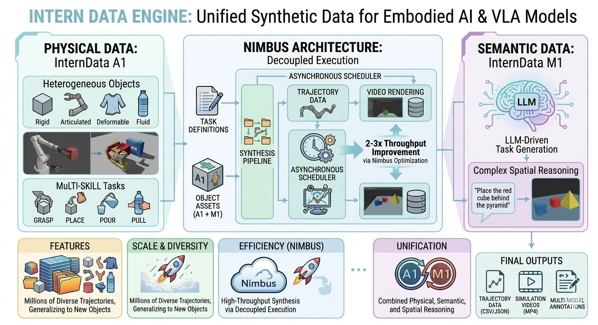

<div align="center">

# InternDataEngine: Pioneering High-Fidelity Synthetic Data Generator for Robotic Manipulation

</div>

<div align="center">

[](https://arxiv.org/abs/2511.16651)
[](https://arxiv.org/abs/2601.21449)
[](https://arxiv.org/abs/2510.13778)
[](https://huggingface.co/datasets/InternRobotics/InternData-A1)
[](https://huggingface.co/datasets/InternRobotics/InternData-M1)
[](https://internrobotics.github.io/InternDataEngine-Docs/)

</div>

## 📚 Contents

- [💻 About](#about)
- [🔥 Latest News](#latest-news)
- [🚀 Quickstart](#quickstart)
  - [🧰 Common asset setup](#common-asset-setup)
  - [ Chapter 1 — Docker Only](#chapter-1-docker-only)
  - [ Chapter 2 — Conda](#chapter-2-conda)
- [📄 License and Citation](#license-and-citation)

<a id="about"></a>

## 💻 About

<div align="center">
  
</div>

InternDataEngine is a synthetic data generation engine for embodied AI that powers large-scale model training and iteration. Built on NVIDIA Isaac Sim, it unifies high-fidelity physical interaction from InternData-A1, semantic task and scene generation from InternData-M1, and high-throughput scheduling from the Nimbus framework to deliver realistic, task-aligned, and massively scalable robotic manipulation data.

- **More realistic physical interaction**: Unified simulation of rigid, articulated, deformable, and fluid objects across single-arm, dual-arm, and humanoid robots, enabling long-horizon, skill-composed manipulation that better supports sim-to-real transfer.
- **More diverse data generation**: By leveraging the internal state of the simulation engine to extract high-quality ground truth, coupled with multi-dimensional domain randomization (e.g., layout, texture, structure, and lighting), the data distribution is significantly expanded. This approach produces precise and diverse operational data, while simultaneously exporting rich multimodal annotations such as bounding boxes, segmentation masks, and keypoints.
- **More efficient large-scale production**: Nimbus-powered asynchronous pipelines that decouple planning, rendering, and storage, achieving 2–3× end-to-end throughput, cluster-level load balancing and fault tolerance for billion-scale data generation.

<a id="latest-news"></a>

## 🔥 Latest News

- **[2026/03]** We release the InternDataEngine codebase v1.0, which includes the core modules: InternData-A1 and Nimbus.

<a id="quickstart"></a>

## 🚀 Quickstart

The repository has two independent simulator chapters. Prepare the shared
assets once, then follow exactly one runtime chapter for each machine.

### Common asset setup

The shared host requirements are a Linux machine with an NVIDIA GPU and working
driver, Python 3.10+, Git, `7z`, and enough disk for the selected assets and
CuRobo checkout. Check the basics with:

```bash
nvidia-smi
python3 --version
git --version
7z
```

On Ubuntu, install missing asset-download tools with:

```bash
sudo apt-get update
sudo apt-get install -y git p7zip-full python3-pip
python3 -m pip install -U modelscope
```

Download and extract the ModelScope split archive from the repository root:

```bash
python3 scripts/download_modelscope.py --token <MODEL_SCOPE_TOKEN>
```

The script downloads `MinMaxMex/InterndataAssets/InternDataAssets_7z`, extracts
`InternDataAssets/`, and creates the scene and `panda_drake` SimBox symlinks.
The ModelScope archive currently contains `assets/custom`, robot assets under
`robots/`, and `panda_drake`; other scene/task assets and both CuRobo
checkouts are excluded.

```text
workflows/simbox/assets -> ../../InternDataAssets/assets
workflows/simbox/panda_drake -> ../../InternDataAssets/panda_drake
```

It refuses to overwrite an existing `InternDataAssets/` directory. If you need
to reinstall assets, move or remove the old directory first.

Clone the CuRobo v2 repository separately after the ModelScope download:

```bash
git clone https://github.com/MaxDYF/curobo.git InternDataAssets/curobov2
git -C InternDataAssets/curobov2 checkout 4ea77366ca48ee453e7df139e39fa6532af49f3b
```

The runtime uses `InternDataAssets/curobov2` directly. It does not download or
require the legacy `InternDataAssets/curobo` checkout.

Verify the shared checkout before entering either chapter:

```bash
test -d InternDataAssets/assets
test -d InternDataAssets/assets/custom
test -d InternDataAssets/robots
test -f InternDataAssets/curobov2/curobo/__init__.py
test -d InternDataAssets/panda_drake
test -L workflows/simbox/assets
test -L workflows/simbox/panda_drake
```

<a id="chapter-1-docker-only"></a>

## 🐳 Chapter 1 — Docker Only

This chapter uses the reproducible production path through
`scripts/docker/up_simbox_isaac.sh`. It does not require a host Isaac Sim or
Conda simulator environment.

### Prerequisites

- Docker Engine with Compose v2
- NVIDIA Container Toolkit
- Enough disk space for Docker images and Isaac Sim caches

Check the Docker runtime and GPU access:

```bash
docker compose version
docker run --rm --gpus all nvidia/cuda:11.8.0-base-ubuntu22.04 nvidia-smi
```

If the entrypoint is not executable, fix it before building:

```bash
chmod +x docker/isaac/entrypoint.sh scripts/docker/up_simbox_isaac.sh
```

### Build and run

Build the Isaac image:

```bash
docker compose -f docker/docker-compose.yml build
```

Start the default single-GPU stack:

```bash
scripts/docker/up_simbox_isaac.sh
```

Stop the stack:

```bash
scripts/docker/stop_all_docker.sh
```

Use `--launcher-config configs/de_pipe_template.yaml` for the pipeline template.
Parallel workers should pass distinct `--stack-id` and `--gpu` values so their
container names and Isaac cache directories remain isolated.

For a persistent Isaac Bash development environment without automatically
starting `launcher.py`, use the isolated developer entrypoint:

```bash
scripts/docker/isaac_dev.sh shell --gpu 0 --build
scripts/docker/isaac_dev.sh start --gpu 0
scripts/docker/isaac_dev.sh exec -- python -c 'import torch; print(torch.__version__)'
scripts/docker/isaac_dev.sh stop
```

It reuses the existing Isaac image, GPU, repository, and CuRobo mounts, while
keeping a separate `isaac-dev-*` container name and `output/isaac-dev/` cache.

### Logs and stop

Watch logs:

```bash
docker compose -f docker/docker-compose.yml logs -f isaac
```

Stop the stack:

```bash
scripts/docker/stop_all_docker.sh
```

By default, this stop script only stops containers named `isaac` and `isaac-*`.
The `isaac` service autostarts `launcher.py` with the selected launcher config.
To stop every running Docker container on the host, set
`DEFAULT_STOP_EVERY_RUNNING_CONTAINER="1"` at the top of the stop script.
Generated data and logs are written to:

- run logs: `output/simbox_plan_with_render/de_time_profile_*.log`
- rendered episodes and LMDB exports: `output/simbox_plan_with_render/...`
- Isaac container logs/cache mounts: `.docker/isaac-sim/`

If you prefer to run from the `docker/` directory directly:

```bash
cd docker
docker compose build
../scripts/docker/up_simbox_isaac.sh
```

<a id="chapter-2-conda"></a>

## 🟢 Chapter 2 — Conda

This chapter runs Isaac Sim natively from a maintained Conda environment. It
uses Python 3.12, Isaac Sim 6.0.1, Torch 2.11/cu128, and the pinned CuRobo v2
checkout at `InternDataAssets/curobov2`.

### Prerequisites

The native runtime requires Linux x86_64, glibc 2.35 or newer, an NVIDIA GPU,
and Conda. Docker and the NVIDIA Container Toolkit are not required for this
chapter. The host Python used to download assets may remain in a separate
environment.

### Install the simulator environment

Create the pinned environment from the repository root:

```bash
scripts/conda/setup_isaac6_env.sh --env interndata-isaac6
```

This installs Python 3.12, Torch 2.11/cu128, Isaac Sim 6.0.1.0, the project
runtime packages, and the dependencies declared by the pinned CuRobo v2
checkout. CuRobo itself is imported directly from
`InternDataAssets/curobov2`; an unrelated `nvidia-curobo` wheel is rejected.

Verify or enter the environment:

```bash
CONDA_ENV=interndata-isaac6 source scripts/conda/activate_isaac6_env.sh
python scripts/conda/verify_isaac6_env.py
```

### Preflight and run a task

Run the package, source-identity, CUDA_HOME, and GPU preflight without starting
Isaac:

```bash
TASK_CONFIG=workflows/simbox/core/configs/tasks/example/sort_the_rubbish.yaml \
GPU_ID=0 \
CONDA_ENV=interndata-isaac6 \
CONDA_PREFLIGHT_ONLY=1 \
scripts/simbox/run_simbox_task.sh
```

Run one task natively after the preflight passes:

```bash
TASK_CONFIG=workflows/simbox/core/configs/tasks/example/sort_the_rubbish.yaml \
GPU_ID=0 \
CONDA_ENV=interndata-isaac6 \
scripts/simbox/run_simbox_task.sh
```

### Run through Agent

The Agent control process can stay in its lightweight environment; select the
native simulator explicitly and point it at the full Isaac environment:

```bash
conda run -n interndata python -m agent run \
  --prompt "put the cup on the tray" \
  --gpu 0 \
  --simulator-backend conda \
  --conda-env interndata-isaac6
```

The setup script supports `--dry-run`, and the task runner supports `DRY_RUN=1`
and `CONDA_PREFLIGHT_ONLY=1` for server diagnostics. Docker remains the Agent
default unless `--simulator-backend conda` (or
`execution.simulator_backend: conda`) is selected.

中文项目内文档：
- [文档索引](./docs/README.md)（API 文档 / 开发文档 / 归档）
- [数据生成 README / Quick Start](./docs/archive/data_generation/README.md)，包含单任务启动、配置分类、Docker 并行生成、资产替换和 SimBox skill 替换。

For more details, please check [Documentation](https://internrobotics.github.io/InternDataEngine-Docs/).

<a id="license-and-citation"></a>

## License and Citation
All the code within this repo are under [CC BY-NC-SA 4.0](https://creativecommons.org/licenses/by-nc-sa/4.0/). Please consider citing our papers if it helps your research.

```BibTeX
@article{tian2025interndata,
  title={Interndata-a1: Pioneering high-fidelity synthetic data for pre-training generalist policy},
  author={Tian, Yang and Yang, Yuyin and Xie, Yiman and Cai, Zetao and Shi, Xu and Gao, Ning and Liu, Hangxu and Jiang, Xuekun and Qiu, Zherui and Yuan, Feng and others},
  journal={arXiv preprint arXiv:2511.16651},
  year={2025}
}

@article{he2026nimbus,
  title={Nimbus: A Unified Embodied Synthetic Data Generation Framework},
  author={He, Zeyu and Zhang, Yuchang and Zhou, Yuanzhen and Tao, Miao and Li, Hengjie and Tian, Yang and Zeng, Jia and Wang, Tai and Cai, Wenzhe and Chen, Yilun and others},
  journal={arXiv preprint arXiv:2601.21449},
  year={2026}
}

@article{chen2025internvla,
  title={Internvla-m1: A spatially guided vision-language-action framework for generalist robot policy},
  author={Chen, Xinyi and Chen, Yilun and Fu, Yanwei and Gao, Ning and Jia, Jiaya and Jin, Weiyang and Li, Hao and Mu, Yao and Pang, Jiangmiao and Qiao, Yu and others},
  journal={arXiv preprint arXiv:2510.13778},
  year={2025}
}
```

<!--
```BibTeX
@misc{interndataengine2026,
  title={InternDataEngine: A Synthetic Data Generation Engine for Robotic Learning},
  author={InternDataEngine Contributors},
  year={2026},
  }
}
``` -->
