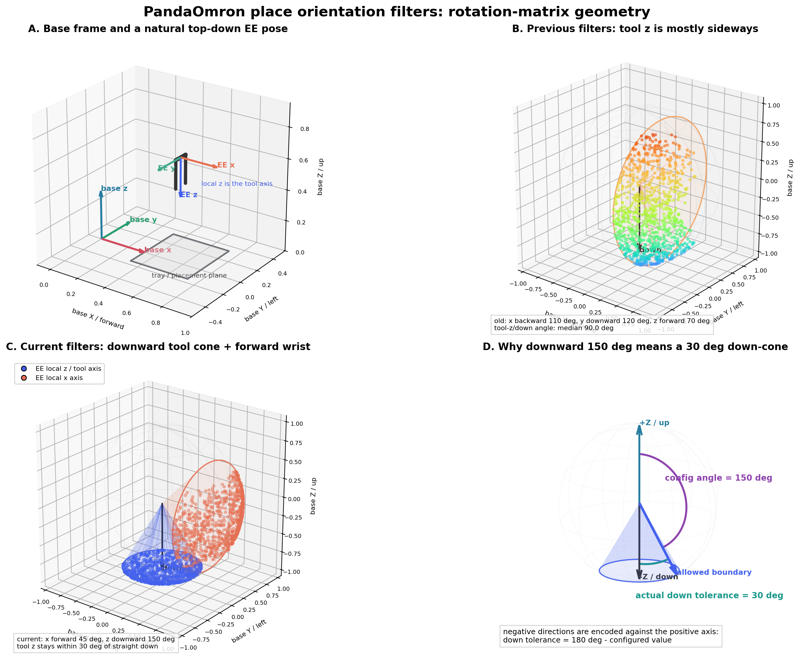

# PandaOmron Place 姿态过滤与调参指南

本文解释 SimBox `place` skill 中以下参数的真实运行语义：

```yaml
filter_x_dir: [forward, 45]
filter_z_dir: [downward, 150]
```

示例来自：

```text
InternDataAssets/assets/custom/scene_8/01_kitchen/assets/basic/
  kitchen_apple_to_tray/simbox_task.yaml
```

本文只讨论 **放置姿态**。`x_ratio_range`、`y_ratio_range`、
`pre_place_z_offset` 和 `place_z_offset` 属于放置位置参数，不在这组姿态调整的范围内。

## 1. 先看结论

当前推荐配置是：

```yaml
- name: place
  id: place_apple_0_id9008
  objects:
  - apple_0_id9008
  - metal_tray_0_id9016
  position_constraint: object
  success_mode: xybbox
  filter_x_dir:
  - forward
  - 45
  filter_z_dir:
  - downward
  - 150
```

它的实际含义是：

1. Panda 末端本地 `z` 轴，也就是工具轴，必须指向下方。
2. 工具轴允许偏离竖直向下最多 `30°`。
3. Panda 末端本地 `x` 轴必须大致朝机器人前方，允许偏差最多 `45°`。
4. 不单独约束本地 `y` 轴，因为旋转矩阵的三个轴互相正交，`x` 和 `z` 已经基本确定 `y`。
5. 这些条件不是在指定唯一姿态，而是在随机姿态中定义两个允许圆锥。

最容易误解的是 `downward, 150`：这里的 `150°` 是相对于基座 `+Z` 向上轴计算，
所以相对于 `-Z` 向下轴的实际容差是：

```text
180° - 150° = 30°
```

## 2. 真实 3D 几何图

下图不是手工绘制的概念图。它使用与
[`Place.generate_constrained_rotation_batch()`](../workflows/simbox/core/skills/place.py)
相同的旋转矩阵元素判断，从 200,000 个随机旋转中筛选并绘制结果。



四个子图分别表示：

### A. 基座坐标系与正常的顶向下姿态

- 基座 `+X`：机器人前方。
- 基座 `+Y`：机器人左方。
- 基座 `+Z`：机器人上方。
- EE `z`：Panda 手部工具轴，正常垂直放置时应指向下方。
- EE `x`：用于稳定手腕的水平朝向。

理想化的顶向下姿态可以写成：

```text
EE x = base +X
EE y = base -Y
EE z = base -Z
```

对应的旋转矩阵是：

```text
R_base_ee = diag(1, -1, -1)
```

当前参数不是强制使用这个唯一矩阵，而是在它附近保留一定角度容差。

### B. 旧参数为什么会让手腕横着或扭着放

旧参数是：

```yaml
filter_x_dir: [backward, 110]
filter_y_dir: [downward, 120]
filter_z_dir: [forward, 70]
```

图中的散点是通过旧条件后，末端本地 `z` 工具轴在单位球上的端点。
它们主要分布在球体前侧，而不是聚集在球体底部。这是因为旧参数明确要求：

```text
EE z 接近 base +X / forward
```

但 Panda 的工具轴正是 EE `z`。因此旧配置实际上把工具轴推向水平方向，
再要求 EE `y` 朝下，视觉结果就是手腕侧翻、横着或以很大的关节扭转角接近托盘。

在固定随机种子下对 200,000 个旋转做统计，旧条件中工具轴与竖直向下的夹角为：

| 指标 | 角度 |
| --- | ---: |
| 中位数 | `90.1°` |
| 95 分位 | `134.6°` |
| 最大值 | `149.8°` |

中位数接近 `90°`，说明典型姿态的工具轴几乎是水平的。

### C. 当前参数如何形成两个允许圆锥

当前配置同时形成：

- 蓝色圆锥：EE `z` 工具轴在竖直向下 `30°` 内。
- 红色圆锥：EE `x` 轴在机器人正前方 `45°` 内。

蓝色散点是通过过滤的 EE `z` 轴端点，红色散点是同一批旋转的 EE `x` 轴端点。
两个轴来自同一个旋转矩阵，因此始终保持正交，不是两批互不相关的方向。

### D. `downward, 150` 的角度为什么看起来反直觉

紫色弧线从 `+Z` 向上轴量到允许边界，角度是 `150°`。
绿色弧线从 `-Z` 向下轴量到同一个边界，角度是 `30°`。

代码直接比较旋转矩阵元素与 `cos(150°)`，所以 YAML 中保存的是紫色角度；
人观察“偏离向下多少”时，通常关心的是绿色角度。

## 3. Panda 的工具轴从哪里确定

机器人配置
[`panda_omron_virtual.yaml`](../workflows/simbox/core/configs/robots/panda_omron_virtual.yaml)
中定义：

```yaml
fl_ee_path: robot0_base/panda_hand

fl_gripper_keypoints:
  tool_head: [0.0, 0.0, 0.1034, 1]
  tool_tail: [0.0, 0.0, 0.0584, 1]
  tool_side: [0.0, 0.04, 0.1034, 1]

ee_axis: z
```

`tool_head` 与 `tool_tail` 只在本地 `z` 坐标上不同，同时 `ee_axis` 明确写成 `z`。
因此对于 PandaOmron：

```text
控制垂直接近方向时，应优先约束 filter_z_dir。
```

把 `filter_y_dir` 设置为 `downward`，不能替代 `filter_z_dir: downward`；
它会让手部侧轴朝下，而不是让工具轴朝下。

## 4. 旋转矩阵中每一列代表什么

`place.py` 生成的目标旋转记为：

```text
             ┌                         ┐
             │ r00   r01   r02         │
R_base_ee =  │ r10   r11   r12         │
             │ r20   r21   r22         │
             └                         ┘
```

每一列是一个 EE 本地轴在基座坐标系中的坐标：

```text
第 0 列 [r00, r10, r20] = EE 本地 x 轴
第 1 列 [r01, r11, r21] = EE 本地 y 轴
第 2 列 [r02, r12, r22] = EE 本地 z 轴
```

因此三个字段选择的是列：

| YAML 字段 | 被约束的局部轴 | 旋转矩阵列 |
| --- | --- | ---: |
| `filter_x_dir` | EE 本地 x | 第 0 列 |
| `filter_y_dir` | EE 本地 y | 第 1 列 |
| `filter_z_dir` | EE 本地 z | 第 2 列 |

方向名称选择的是行：

| direction | 基座方向 | 使用的矩阵行 |
| --- | --- | ---: |
| `forward` | `+X` | 第 0 行 |
| `backward` | `-X` | 第 0 行 |
| `leftward` | `+Y` | 第 1 行 |
| `rightward` | `-Y` | 第 1 行 |
| `upward` | `+Z` | 第 2 行 |
| `downward` | `-Z` | 第 2 行 |

字段和 direction 组合后，就能定位到一个具体矩阵元素。

例如：

```text
filter_x_dir + forward  -> r00
filter_y_dir + downward -> r21
filter_z_dir + forward  -> r02
filter_z_dir + downward -> r22
```

这些矩阵元素就是两个单位向量的点积，也就是夹角的余弦。

## 5. 正方向和负方向的两套角度语义

实现位于
[`place.py`](../workflows/simbox/core/skills/place.py)，核心逻辑是：

```python
cos_val = np.cos(np.deg2rad(value))

if sign > 0:
    valid_mask &= element >= cos_val
else:
    valid_mask &= element <= cos_val
```

### 5.1 正方向

`forward`、`leftward`、`upward` 属于正方向，条件是：

```text
dot(local_axis, positive_base_axis) >= cos(value)
```

所以 `value` 就是相对目标正方向的最大允许偏差。

示例：

```yaml
filter_x_dir: [forward, 45]
```

实际条件：

```text
r00 >= cos(45°) = 0.7071
angle(EE x, base +X) <= 45°
```

### 5.2 负方向

`backward`、`rightward`、`downward` 属于负方向，但代码仍然使用相应的正轴元素，
只把比较符号改成小于等于：

```text
dot(local_axis, positive_base_axis) <= cos(value)
```

因此 YAML 中的 `value` 是相对于正方向的最小夹角。相对于目标负方向的实际容差是：

```text
negative_direction_tolerance = 180° - value
```

示例：

```yaml
filter_z_dir: [downward, 150]
```

实际条件：

```text
r22 <= cos(150°) = -0.8660
angle(EE z, base +Z) >= 150°
angle(EE z, base -Z) <= 30°
```

### 5.3 常用负方向换算表

| YAML 数值 | 相对目标负方向的实际容差 |
| ---: | ---: |
| `120` | `60°` |
| `130` | `50°` |
| `140` | `40°` |
| `150` | `30°` |
| `160` | `20°` |
| `170` | `10°` |
| `180` | `0°`，理论上完全对齐 |

一个常见错误是写：

```yaml
filter_z_dir: [downward, 30]
```

它并不表示“向下偏差不超过 30°”。代码会检查：

```text
r22 <= cos(30°) = 0.866
```

这会接受绝大多数旋转，只排除非常接近向上的姿态，几乎起不到向下约束作用。

### 5.4 三元素格式需要谨慎

代码也接受：

```yaml
filter_z_dir: [direction, value1, value2]
```

但正方向和负方向使用不同的比较顺序，它不是一个统一、直观的
`[min_angle, max_angle]` 接口。当前任务只需要单圆锥，两元素格式更容易验证，也更不容易写反。

## 6. 当前两个参数的完整推导

### 6.1 `filter_x_dir: [forward, 45]`

字段选择 EE 本地 x 轴，即旋转矩阵第 0 列；`forward` 选择基座 `+X`，即第 0 行。
最终检查：

```text
R_base_ee[0, 0] >= cos(45°)
```

几何意义：

```text
EE x 必须落在以 base +X 为中心、半角 45° 的圆锥中。
```

单独看，它约束的是 EE x 轴完整的三维方向，不仅仅是平面 yaw。
但与“EE z 接近竖直向下”结合后，它主要起到稳定手腕水平朝向、避免腕部绕竖直轴任意翻转的作用。

### 6.2 `filter_z_dir: [downward, 150]`

字段选择 EE 本地 z 工具轴，即第 2 列；`downward` 选择基座 `-Z`，使用第 2 行的负方向判断。
最终检查：

```text
R_base_ee[2, 2] <= cos(150°)
```

几何意义：

```text
EE z 必须落在以 base -Z 为中心、半角 30° 的圆锥中。
```

这条是保证“正常向下放置”的主约束。

### 6.3 为什么不再写 `filter_y_dir`

一个合法旋转矩阵满足：

```text
EE x ⟂ EE y
EE y ⟂ EE z
EE z ⟂ EE x
EE x × EE y = EE z
```

当 EE x 已经接近前方，EE z 已经接近下方时，EE y 会自然接近右方。
再增加一个宽泛或方向错误的 y 约束可能带来三个问题：

1. 把本来正常的顶向下姿态过滤掉。
2. 强迫手腕侧翻以满足 y 轴方向。
3. 让有效随机候选降到 0，触发无约束回退。

因此对于这个顶向下放置任务，约束工具轴加一个水平轴已经足够。

## 7. 参数如何进入实际规划

实际流程不是“读取角度后直接命令机械臂到固定四元数”，而是：

```text
1. scipy 生成 3000 个均匀随机旋转矩阵
2. filter_x_dir / filter_y_dir / filter_z_dir 生成布尔 mask
3. 保留满足全部条件的旋转
4. 从有效旋转中随机抽取 CUROBO_BATCH_SIZE=20 个
5. 为每个旋转构造 pre-place 和 place 目标
6. CuRobo 检查 IK、碰撞和轨迹可达性
7. 选择可执行候选
```

`CUROBO_BATCH_SIZE` 当前定义为 `20`，见
[`constants.py`](../workflows/simbox/core/utils/constants.py)。

这带来两个直接结论：

1. 同一份 YAML 在不同运行中可能得到略有不同的最终四元数，但不会超出配置圆锥。
2. 姿态约束越严格，随机筛选后的候选越少，规划失败概率通常越高。

### 有效候选为 0 时的危险回退

当前实现中，如果没有旋转满足姿态约束，会打印：

```text
Warning: No matrix satisfies constraints
```

然后返回最初 3000 个随机旋转中的前 20 个：

```python
if len(valid_rot_mats) == 0:
    return rot_mats[:CUROBO_BATCH_SIZE]
```

这 20 个回退姿态不再满足 YAML 约束。因此运行验证时不能只看 skill 有没有继续执行，
还必须检查日志里是否出现该警告。

## 8. `position_constraint: object` 会不会改变姿态参数含义

不会。它改变的是“采样位置属于物体中心还是夹爪中心”，并保留当前抓取时的物体与夹爪相对变换。

代码先记录抓取关系：

```text
T_obj_ee = inverse(T_world_obj) × T_world_ee
```

设筛选出来的末端旋转是 `R_base_ee_sampled`，当前物体到末端的旋转是 `R_obj_ee`，则：

```text
R_base_obj_target = R_base_ee_sampled × inverse(R_obj_ee)
```

随后重新得到末端目标：

```text
R_base_ee_target
  = R_base_obj_target × R_obj_ee
  = R_base_ee_sampled × inverse(R_obj_ee) × R_obj_ee
  = R_base_ee_sampled
```

因此：

```text
filter_*_dir 过滤的仍然是最终 EE 姿态。
```

`position_constraint: object` 同时根据抓取关系推导苹果的目标姿态，避免忽略苹果与夹爪之间已经建立的刚性关系。

## 9. 与姿态无关的 place 参数

以下字段不会决定手腕朝向：

| 字段 | 实际作用 |
| --- | --- |
| `x_ratio_range` | 在目标对象 world bbox 的 X 范围内按比例采样位置。 |
| `y_ratio_range` | 在目标对象 world bbox 的 Y 范围内按比例采样位置。 |
| `pre_place_z_offset` | pre-place 位置高于目标 bbox 顶部的距离。 |
| `place_z_offset` | 最终 place 位置高于目标 bbox 顶部的距离。 |
| `success_mode: xybbox` | 放置完成后，检查物体中心 XY 是否进入目标 bbox。 |
| `gripper_change_steps` | 到达 place pose 后重复松开夹爪命令的步数。 |

特别注意：

```text
place_success_check_snapshot.json 只能证明物体位置是否满足成功条件，
不能证明机械臂的放置姿态是否自然。
```

当前 `xybbox` 检查只读取物体中心 XY 和目标 bbox，不检查末端旋转、腕部关节角或工具轴倾角。

## 10. 推荐调参档位

下面三档都保持“工具 z 朝下、末端 x 朝前”的正确轴选择，只改变圆锥宽度：

| 档位 | 参数 | 最大向下倾斜 | 200k 样本通过率 | 预计每 3000 个候选通过数 |
| --- | --- | ---: | ---: | ---: |
| 宽松 | `x forward 60`, `z downward 140` | `40°` | `3.735%` | `112` |
| 当前平衡 | `x forward 45`, `z downward 150` | `30°` | `1.566%` | `47` |
| 严格 | `x forward 30`, `z downward 160` | `20°` | `0.468%` | `14` |

统计使用 200,000 个随机旋转和固定种子 `7`。实际每轮数量会随机波动。

建议调整顺序：

1. 首先保证 `filter_z_dir` 约束的是 Panda 工具轴，并保持 `downward`。
2. 如果姿态仍然倾斜，先把 `downward, 150` 收紧为 `downward, 160`。
3. 如果腕部绕竖直方向扭转明显，把 `forward, 45` 收紧为 `forward, 30`。
4. 如果 CuRobo 找不到可达解，优先放宽水平 x 约束，例如从 `45` 放宽到 `60`，不要先取消 z 向下约束。
5. 每次只修改一个角度，并记录有效候选数、规划结果和实际视频姿态。

不要一开始就同时约束 x、y、z 三个轴。三个宽泛约束不一定比两个清晰约束更稳定，
还可能因为轴之间必须正交而意外得到非常小的交集。

## 11. 复现 3D 图和候选统计

生成脚本：

```text
scripts/visualize_place_orientation_filters.py
```

运行命令：

```bash
MPLCONFIGDIR=/tmp/matplotlib-cache \
  /home/dyf/miniconda3/envs/anygrasp/bin/python \
  scripts/visualize_place_orientation_filters.py
```

默认输出：

```text
docs/images/panda_omron_place_orientation_filters_3d.png
```

可以改变样本数和随机种子：

```bash
MPLCONFIGDIR=/tmp/matplotlib-cache \
  /home/dyf/miniconda3/envs/anygrasp/bin/python \
  scripts/visualize_place_orientation_filters.py \
  --samples 500000 \
  --seed 11 \
  --output /tmp/place_orientation_filters.png
```

脚本中的 `_previous_mask()` 和 `_current_mask()` 直接对应旧、新 YAML 的矩阵判断，
适合在提交参数前先确认圆锥方向有没有写反。

## 12. 运行验证清单

静态数学检查通过后，还需要实际 Isaac/CuRobo 验证，因为“几何方向正确”不等于“机械臂一定可达”。

### 12.1 规划阶段

检查日志：

```text
length of valid place rots : <N>
place plan success
```

要求：

- `<N>` 应显著大于 0。
- 不应出现 `Warning: No matrix satisfies constraints`。
- 不应连续出现 CuRobo plan failure。

### 12.2 动作阶段

从视频或 EE 姿态记录检查：

- 工具轴从 pre-place 到 place 始终大致向下。
- 手腕没有在接近托盘前突然翻转 90° 或 180°。
- pre-place 到 place 的旋转变化应很小；两者使用同一个采样旋转，理论上只有位置变化。
- 夹爪应从托盘上方接近，而不是侧向插入。
- Panda 第 6、7 关节不应为了满足错误轴方向出现极端卷曲。

### 12.3 放置结果阶段

检查：

```text
output/ros_bridge/skills/
  panda_omron_place_apple_0_id9008_to_metal_tray_0_id9016_*/
    place_success_check_snapshot.json
```

它用于确认苹果最终是否在托盘 bbox 内，但要与视频或 EE 旋转记录一起判断。

正确的结论应分成两项：

```text
姿态质量：工具轴向下、腕部自然、轨迹连续。
任务结果：苹果最终进入目标区域并通过 success check。
```

二者不能互相替代。

## 13. 常见错误

### 错误 1：把方向名理解成移动方向

`filter_z_dir: downward` 不表示机械臂的位置轨迹向下移动。
位置轨迹由 pre-place/place 位置和 offset 决定；该字段只筛选旋转。

### 错误 2：把 `downward, 30` 理解成向下 30° 圆锥

当前实现中应写成 `downward, 150`。负方向的实际容差是 `180° - value`。

### 错误 3：约束错了工具轴

Panda 的 `ee_axis` 是 `z`。约束 `filter_y_dir: downward` 会让手部侧轴朝下。

### 错误 4：认为 `forward` 是固定世界方向

这里的目标旋转被构造在机械臂基座坐标系中。移动底盘转向后，base `+X` 会随机器人一起转动；
它表示机器人当前前方，不是场景中永远不变的 world `+X`。

### 错误 5：只看任务是否成功

`success_mode: xybbox` 可能在手腕姿态很扭曲时仍然成功，也可能在姿态正常但物体滚出托盘时失败。
它不是姿态质量指标。

### 错误 6：把约束收得过紧但忽略无候选回退

如果有效旋转为 0，当前代码会回退到未过滤的随机姿态。必须检查日志中的候选数和警告。

## 14. 当前任务的建议边界

对 `kitchen_apple_to_tray`，当前配置：

```yaml
filter_x_dir: [forward, 45]
filter_z_dir: [downward, 150]
```

是一个合理的第一版平衡点：

- 工具轴最大倾斜 `30°`，足以消除旧配置中典型的水平工具姿态。
- EE x 最大偏离前方 `45°`，限制腕部翻转但保留一定 IK 余量。
- 数值采样预计每 3000 个旋转保留约 47 个，明显高于 20 个 CuRobo batch 大小。

在没有新运行证据前，不建议同时修改放置位置、释放高度或成功判定来掩盖姿态问题。
下一轮只应根据实际视频和规划日志决定是收紧 z 倾角，还是放宽 x 朝向。

## 15. 代码入口

- 当前任务配置：
  [`simbox_task.yaml`](../InternDataAssets/assets/custom/scene_8/01_kitchen/assets/basic/kitchen_apple_to_tray/simbox_task.yaml)
- Place 姿态生成：
  [`workflows/simbox/core/skills/place.py`](../workflows/simbox/core/skills/place.py)
- PandaOmron EE 坐标配置：
  [`workflows/simbox/core/configs/robots/panda_omron_virtual.yaml`](../workflows/simbox/core/configs/robots/panda_omron_virtual.yaml)
- CuRobo batch 大小：
  [`workflows/simbox/core/utils/constants.py`](../workflows/simbox/core/utils/constants.py)
- 3D 图生成脚本：
  [`scripts/visualize_place_orientation_filters.py`](../scripts/visualize_place_orientation_filters.py)

