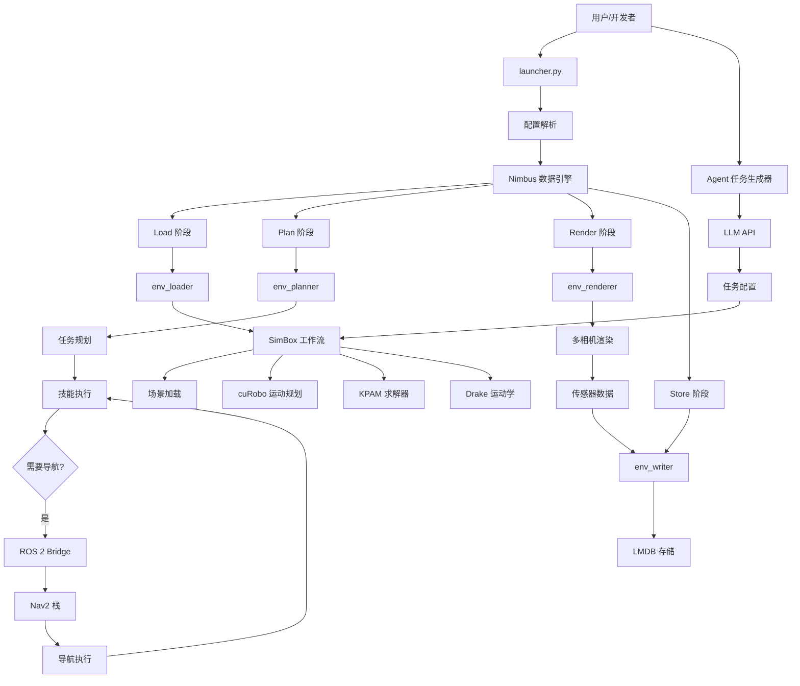
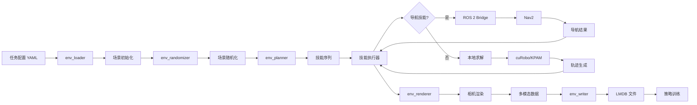
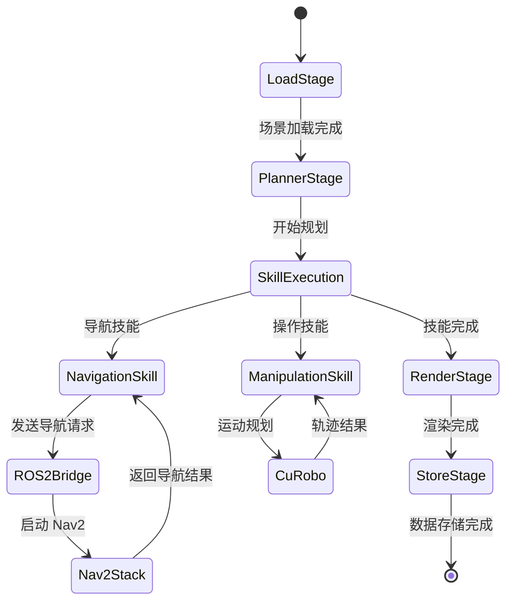
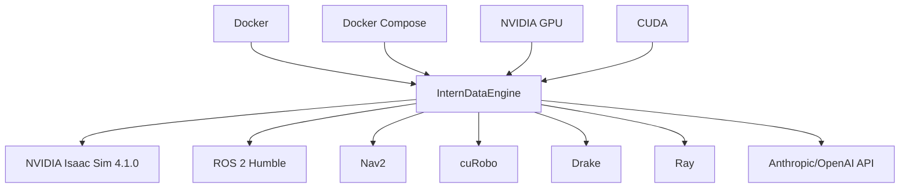
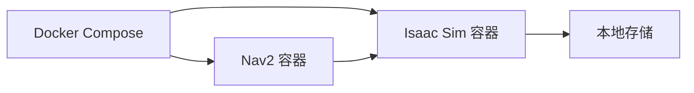
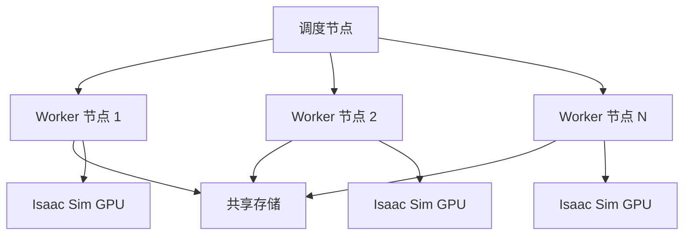

# InternDataEngine 生产级项目文档

## 文档版本信息

- **文档版本**: v1.0
- **生成日期**: 2026-04-24
- **项目版本**: v1.0
- **适用项目**: InternDataEngine

---

# 项目概述

## 项目定位

InternDataEngine 是一个面向具身智能（Embodied AI）的高保真合成数据生成引擎，专门用于支撑大规模模型训练和迭代。该项目基于 NVIDIA Isaac Sim 仿真平台构建，整合了 InternData-A1 的高保真物理交互、InternData-M1 的语义任务和场景生成能力，以及 Nimbus 框架的高吞吐调度系统，提供真实、任务对齐、可大规模扩展的机器人操作数据。

## 核心目标

1. **更真实的物理交互**: 统一仿真刚体、铰链、变形体和流体对象，支持单臂、双臂和人形机器人的长时程、技能组合操作，更好地支持从仿真到真实的迁移
2. **更多样的数据生成**: 利用仿真引擎内部状态提取高质量真��，结合多维域随机化（布局、纹理、结构、光照），显著扩展数据分布，生成精确多样的操作数据，同时导出丰富的多模态标注（边界框、分割掩码、关键点）
3. **更高效的大规模生产**: 基于 Nimbus 的异步流水线，解耦规划、渲染和存储，实现 2-3 倍的端到端吞吐量，集群级负载均衡和容错，支持十亿级数据生成

## 主要功能

- **多机器人平台支持**: 支持单臂、双臂、移动操作等多种机器人配置
- **高保真物理仿真**: 基于 Isaac Sim 的高精度物理引擎，支持复杂物体交互
- **任务级数据生成**: 支持导航、抓取、放置、操作等多种原子技能组合
- **大规模场景随机化**: 支持场景布局、光照、纹理、物体位置等多维度随机化
- **异步数据处理**: 通过 Nimbus 框架实现规划、渲染、存储的异步并行处理
- **多模态数据导出**: 支持图像、深度、分割、姿态等多种数据格式
- **LMDB 数据存储**: 高效的 LMDB 格式数据存储，支持大规模数据集构建
- **ROS2/Nav2 集成**: 支持与 ROS2 生态系统的深度集成，实现导航与操作的无缝衔接

## 适用场景

- 机器人操作策略预训练数据生成
- Sim-to-Real 迁移研究
- 多模态感知模型训练
- 具身智能算法开发与验证
- 大规模机器人数据集构建

---

# 技术栈

## 核心技术栈

| 技术 | 版本 | 作用 |
|------|------|------|
| **Python** | 3.10+ | 主要开发语言 |
| **NVIDIA Isaac Sim** | 4.1.0 | 物理仿真引擎 |
| **PyTorch** | - | 深度学习框架 |
| **JAX** | - | 用于 OpenPI 策略训练 |
| **ROS 2** | Humble | 机器人中间件，用于 Nav2 导航集成 |
| **Nav2** | - | ROS 2 导航栈 |

## 仿真与物理

| 技术 | 版本 | 作用 |
|------|------|------|
| **Drake** | 1.51.1 | 运动学和动力学计算 |
| **cuRobo** | - | GPU 加速的运动规划 |
| **PhysX** | - | 物理仿真引擎（Isaac Sim 内置） |
| **OmniGraph** | - | Isaac Sim 计算图框架 |

## 数据处理与存储

| 技术 | 版本 | 作用 |
|------|------|------|
| **LMDB** | 2.2.0 | 高效数据库存储 |
| **NumPy** | 1.26.0 | 数值计算 |
| **SciPy** | 1.14.1 | 科学计算 |
| **OpenCV** | 4.10.0.84 | 图像处理 |
| **Open3D** | 0.19.0 | 3D 数据处理 |
| **Trimesh** | 4.11.5 | 网格处理 |
| **imageio** | 2.37.3 | 图像/视频 I/O |
| **scikit-image** | 0.25.2 | 图像处理算法 |
| **scikit-learn** | 1.7.2 | 机器学习工具 |

## 并行计算与调度

| 技术 | 版本 | 作用 |
|------|------|------|
| **Ray** | 2.54.1 | 分布式计算框架 |
| **Nimbus** | - | 自研的异步数据生成流水线框架 |

## 配置管理

| 技��� | 版本 | 作用 |
|------|------|------|
| **OmegaConf** | 2.3.0 | 层次化配置管理 |
| **PyYAML** | 6.0.3 | YAML 配置解析 |
| **Pydantic** | 2.8.0 | 数据验证 |

## 容器化与部署

| 技术 | 作用 |
|------|------|
| **Docker** | 容器化部署 |
| **Docker Compose** | 多容器编排 |
| **NVIDIA Container Toolkit** | GPU 容器支持 |

## 代码质量工具

| 技术 | 版本 | 作用 |
|------|------|------|
| **pytest** | - | 单元测试框架 |
| **black** | 22.3.0 | 代码格式化 |
| **isort** | 5.12.0 | import 排序 |
| **flake8** | 3.9.2 | 代码风格检查 |
| **pylint** | 2.15.0 | 代码质量检查 |
| **pre-commit** | 3.1.0 | Git 钩子管理 |

## AI/LLM 集成

| 技术 | 作用 |
|------|------|
| **Anthropic Claude API** | 任务配置生成 |
| **OpenAI API** | 任务配置生成（兼容接口） |
| **Hugging Face Hub** | 模型和数据集下载 |

---

# 项目目录结构

```
InterndataEngine/
├── agent/                          # LLM 驱动的任务配置生成器
│   ├── config.yaml                 # Agent 配置文件（非敏感）
│   ├── .env                        # API 密钥（不提交）
│   ├── .env.example                # 环境变量示例
│   ├── task_generator.py           # 任务生成主程序
│   ├── prompts/                    # 提示词模板
│   │   ├── system.txt              # 系统提示词
│   │   └── user_template.txt       # 用户提示词模板
│   └── output/                     # 生成的任务配置输出目录
│
├── configs/                        # 顶层配置模板
│   ├── de_pipe_template.yaml       # 流水线模板
│   ├── de_plan_template.yaml       # 规划模板
│   ├── de_plan_with_render_template.yaml  # 规划+渲染模板
│   ├── de_render_template.yaml     # 渲染模板
│   └── de_plan_and_render_template.yaml   # 规划和渲染模板
│
├── deps/                           # 外部依赖
│   └── world_toolkit/              # 世界工具包
│
├── docker/                         # Docker 容器配置
│   ├── docker-compose.yml          # 主栈（Isaac + Nav2）
│   ├── docker-compose.agent.yml    # Agent 独立服务
│   ├── isaac/                      # Isaac Sim 容器
│   │   ├── Dockerfile
│   │   └── entrypoint.sh           # 容器启动脚本
│   ├── nav2/                       # Nav2 容器
│   │   ├── Dockerfile
│   │   └── entrypoint.sh
│   └── agent/                      # Agent 容器
│       └── Dockerfile
│
├── docs/                           # 项目文档
│   └── images/                     # 文档图片资源
│
├── InternDataAssets/               # 内部数据资产
│   ├── assets/                     # 3D 资产（链接到 workflows/simbox/assets）
│   ├── curobo/                     # cuRobo 运动规划库
│   └── panda_drake/                # Panda 机械臂 Drake 模型
│
├── nav2/                           # ROS 2 / Nav2 集成
│   ├── bridge/                     # Isaac-ROS 桥接代码
│   ├── container/                  # Nav2 容器构建文件
│   ├── mapgen/                     # 地图生成工具
│   └── runtime/                    # Nav2 运行时管理
│
├── nimbus/                         # Nimbus 异步数据生成框架
│   ├── components/                 # 核心组件
│   │   ├── data/                   # 数据组件
│   │   ├── dedump/                 # 反序列化组件
│   │   ├── dump/                   # 序列化组件
│   │   ├── load/                   # 加载组件
│   │   ├── planner/                # 规划组件
│   │   ├── plan_with_render/       # 规划+渲染组件
│   │   ├── render/                 # 渲染组件
│   │   └── store/                  # 存储组件
│   ├── daemon/                     # 守护进程
│   ├── data_engine.py              # 数据引擎主类
│   ├── dist_sim/                   # 分布式仿真
│   ├── scheduler/                  # 调度器
│   └── utils/                      # 工具函数
│
├── nimbus_extension/               # Nimbus 扩展组件（SimBox 专用）
│   └── components/
│       ├── dump/                   # 环境序列化
│       ├── dedump/                 # 环境反序列化
│       ├── load/                   # 环境加载
│       ├── plan_with_render/       # 规划渲染一体化
│       ├── planner/                # 环境规划
│       ├── render/                 # 环境渲染
│       └── store/                  # 环境存储
│
├── output/                         # 默认输出目录
│   ├── simbox_plan_with_render/    # 规划+渲染输出
│   ├── ros_bridge/                 # ROS 桥接输出
│   │   ├── runtime_requests/       # Nav2 运行时请求
│   │   └── skills/                 # 技能执行结果
│   └── ...                         # 其他输出
│
├── policy/                         # 策略相关代码
│   ├── lmdb2lerobotv21/            # LMDB 到 LeRobot 格式转换
│   │   ├── lmdb2lerobot_split_aloha_a1.py
│   │   ├── lmdb2lerobot_lift2_a1.py
│   │   ├── lmdb2lerobot_genie1_a1.py
│   │   ├── lmdb2lerobot_frankarobotiq_a1.py
│   │   ├── lmdb2lerobot_franka_a1.py
│   │   └── convertv21_to_v30.py
│   └── openpi-InternData-A1/       # OpenPI 策略实现
│       ├── docs/                   # 策略文档
│       ├── scripts/                # 训练脚本
│       └── examples/              # 示例代码
│
├── pre/                            # 预处理脚本
│
├── scripts/                        # 辅助脚本
│   ├── docker/                     # Docker 相关脚本
│   │   └── up_nav2_stack.sh        # 启动 Nav2 栈
│   ├── simbox/                     # SimBox 工具脚本
│   │   ├── record_collaborate_topdown_mp4.py
│   │   └── visualize_nav2_failure.py
│   ├── download_assets.sh          # 资产下载脚本
│   ├── generate_pick_configs.py    # 生成抓取配置
│   └── setup_isaac_ros_py310.sh    # Isaac ROS 环境设置
│
├── test/                           # 测试代码
│   ├── unit/                       # 单元测试
│   └── conftest.py                 # pytest 配置
│
├── tests/                          # 测试目录（别名）
│
├── workflows/                      # 工作流定义
│   ├── base.py                     # 工作流基类
│   ├── simbox_dual_workflow.py     # SimBox 双臂工作流
│   ├── utils/                      # 工作流工具
│   └── simbox/                     # SimBox 工作流
│       ├── assets/                 # 资产链接 → ../../InternDataAssets/assets
│       ├── curobo/                 # cuRobo 链接 → ../../InternDataAssets/curobo
│       ├── core/                   # 核心组件
│       │   ├── cameras/            # 相机配置
│       │   ├── configs/            # 配置文件
│       │   │   ├── arenas/         # 场景配置
│       │   │   ├── bases/          # 机器人底盘配置
│       │   │   ├── cameras/        # 相机配置
│       │   │   ├── robots/         # 机器人配置
│       │   │   ├── tasks/          # 任务配置
│       │   │   │   ├── basic/      # 基础任务
│       │   │   │   ├── long_horizon/  # 长时程任务
│       │   │   │   └── mobile_manipulation/  # 移动操作任务
│       │   │   ├── world.yaml      # 世界配置
│       │   │   └── logger.yaml     # 日志配置
│       │   ├── controllers/        # 控制器
│       │   ├── loggers/            # 日志记录器
│       │   ├── mobile/             # 移动平台
│       │   ├── objects/            # 物体定义
│       │   ├── robots/             # 机器人定义
│       │   ├── skills/             # 技能定义
│       │   ├── tasks/              # 任务定义
│       │   └── utils/              # 工具函数
│       ├── example_assets/         # 示例资产
│       ├── panda_drake/            # Panda Drake 链接
│       ├── solver/                 # 求解器
│       │   └── kpam/               # 关键点调整操作求解器
│       └── tools/                  # 工具集
│
├── .docker/                        # Docker 运行时数据（忽略）
│   └── isaac-sim/                  # Isaac Sim 缓存
│
├── .git/                           # Git 仓库
│
├── .gitignore                      # Git 忽略规则
├── .pre-commit-config.yaml         # Pre-commit 钩子配置
├── .pylintrc                       # Pylint 配置
├── pyproject.toml                  # 项目元数据
├── pyrightconfig.json              # Pyright 配置
├── README.md                       # 项目说明
├── requirements.txt                # Python 依赖
├── launcher.py                     # 主入口程序
└── download_assets_v2.py           # 资产下载脚本
```

---

# 核心模块说明

## 1. Launcher（启动器）

**文件位置**: [launcher.py](launcher.py)

**职责**: 项目主入口，负责解析配置、初始化环境、启动数据引擎。

**核心功能**:
- 解析命令行参数和配置文件
- 初始化环境和随机种子
- 调用 Nimbus 数据引擎执行数据生成任务

**使用方式**:
```bash
python launcher.py --config configs/de_plan_with_render_template.yaml
```

**关键参数**:
- `--config`: 配置文件路径（必填）
- `--random_seed`: 随机种子
- `--debug`: 启用调试模式

---

## 2. Nimbus 数据引擎

**目录**: [nimbus/](nimbus/)

**职责**: 异步数据生成流水线框架，实现规划、渲染、存储的解耦和并行处理。

### 2.1 核心组件

| 组件 | 路径 | 职责 |
|------|------|------|
| **DataEngine** | [data_engine.py](nimbus/data_engine.py) | 单机数据引擎 |
| **DistPipeDataEngine** | [data_engine.py](nimbus/data_engine.py) | 分布式流水线数据引擎 |
| **Scheduler** | [scheduler/](nimbus/scheduler/) | 任务调度器 |
| **Components** | [components/](nimbus/components/) | 可复用的数据处理组件 |

### 2.2 数据引擎类型

#### DataEngine（单机模式）
适用于单机数据处理，按顺序执行各个阶段。

#### DistPipeDataEngine（分布式模式）
适用于集群部署，支持流水线并行和 worker 调度。

### 2.3 Nimbus 组件类型

| 组件类型 | 说明 | 示例 |
|---------|------|------|
| **load** | 加载环境和场景 | env_loader |
| **planner** | 规划任务轨迹 | env_planner |
| **plan_with_render** | 规划和渲染一体化 | plan_with_render |
| **render** | 渲染图像和传感器数据 | env_renderer |
| **dump** | 序列化环境状态 | env_dumper |
| **dedump** | 反序列化环境状态 | base_dedumper |
| **store** | 存储数据到磁盘/LMDB | env_writer |
| **data** | 数据处理和转换 | - |

---

## 3. Nimbus Extension（SimBox 扩展）

**目录**: [nimbus_extension/](nimbus_extension/)

**职责**: 为 SimBox 工作流定制的 Nimbus 组件实现。

### 3.1 核心组件

| 组件 | 文件 | 职责 |
|------|------|------|
| **env_loader** | [components/load/env_loader.py](nimbus_extension/components/load/env_loader.py) | 加载 SimBox 环境 |
| **env_randomizer** | [components/load/env_randomizer.py](nimbus_extension/components/load/env_randomizer.py) | 场景随机化 |
| **env_planner** | [components/planner/env_planner.py](nimbus_extension/components/planner/env_planner.py) | 任务规划 |
| **plan_with_render** | [components/plan_with_render/plan_with_render.py](nimbus_extension/components/plan_with_render/plan_with_render.py) | 规划渲染一体化 |
| **env_renderer** | [components/render/env_renderer.py](nimbus_extension/components/render/env_renderer.py) | 渲染传感器数据 |
| **env_dumper** | [components/dump/env_dumper.py](nimbus_extension/components/dump/env_dumper.py) | 环境序列化 |
| **base_dedumper** | [components/dedump/base_dedumper.py](nimbus_extension/components/dedump/base_dedumper.py) | 环境反序列化 |
| **env_writer** | [components/store/env_writer.py](nimbus_extension/components/store/env_writer.py) | LMDB 数据写入 |

---

## 4. SimBox 工作流

**目录**: [workflows/simbox/](workflows/simbox/)

**职责**: 机器人操作仿真工作流，定义任务、场景、机器人、物体、技能等。

### 4.1 目录结构

| 子目录 | 职责 |
|--------|------|
| **core/** | 核心仿真组件 |
| **assets/** | 3D 资产（链接） |
| **curobo/** | 运动规划库（链接） |
| **panda_drake/** | Panda 模型（链接） |
| **example_assets/** | 示例资产 |
| **solver/** | 求解器（KPAM） |
| **tools/** | 仿真工具 |

### 4.2 核心组件

#### 4.2.1 配置系统

**目录**: [workflows/simbox/core/configs/](workflows/simbox/core/configs/)

| 配置类型 | 目录 | 说明 |
|---------|------|------|
| **任务配置** | [tasks/](workflows/simbox/core/configs/tasks/) | 定���机器人任务 |
| **机器人配置** | [robots/](workflows/simbox/core/configs/robots/) | 机器人模型和参数 |
| **场景配置** | [arenas/](workflows/simbox/core/configs/arenas/) | 仿真场景布局 |
| **相机配置** | [cameras/](workflows/simbox/core/configs/cameras/) | 相机参数 |
| **底盘配置** | [bases/](workflows/simbox/core/configs/bases/) | 移动底盘参数 |

#### 4.2.2 任务类型

| 任务类别 | 目录 | 说明 |
|---------|------|------|
| **基础任务** | [tasks/basic/](workflows/simbox/core/configs/tasks/basic/) | 单步操作（抓取、放置等） |
| **长时程任务** | [tasks/long_horizon/](workflows/simbox/core/configs/tasks/long_horizon/) | 多步操作序列 |
| **移动操作** | [tasks/mobile_manipulation/](workflows/simbox/core/configs/tasks/mobile_manipulation/) | 导航+操作组合 |

#### 4.2.3 机器人类型

支持的机器人配置：
- **Split ALOHA**: 双臂移动操作机器人
- **Franka**: 单臂机器人
- **Franka RobotiQ**: 带夹爪的 Franka
- **Genie1**: 通用机器人
- **Lift2**: 提升机器人

#### 4.2.4 技能系统

**目录**: [workflows/simbox/core/skills/](workflows/simbox/core/skills/)

支持的原子技能：
- **navigate**: 导航到目标位姿
- **pick**: 抓取物体
- **place**: 放置物体
- **heuristic__skill**: 启发式技能（如 home 位置）

### 4.3 工作流基类

**文件**: [workflows/base.py](workflows/base.py)

定义工作流的基础接口和通用功能。

### 4.4 SimBox 双臂工作流

**文件**: [workflows/simbox_dual_workflow.py](workflows/simbox_dual_workflow.py)

实现双臂机器人的仿真工作流，支持：
- 场景加载和随机化
- 任务规划和执行
- 多相机渲染
- 数据采集和存储

---

## 5. ROS 2 / Nav2 集成

**目录**: [nav2/](nav2/)

**职责**: 与 ROS 2 Humble 和 Nav2 导航栈集成，实现移动机器人的导航功能。

### 5.1 目录结构

| 子目录 | 职责 |
|--------|------|
| **bridge/** | Isaac Sim 与 ROS 2 的桥接代码 |
| **container/** | Nav2 容器构建文件 |
| **mapgen/** | 地图生成工具 |
| **runtime/** | Nav2 运行时管理（动态启动/停止 Nav2 栈） |

### 5.2 集成方式

- 使用 Isaac Sim 的 ROS 2 Bridge 进行通信
- 通过共享文件系统传递导航请求和结果
- 支持多会话并发运行（通过 UUID 隔离）

### 5.3 导航技能配置

任务配置中的 `navigate` 技能参数：
- `goal_x`, `goal_y`, `goal_yaw`: 目标位姿
- `xy_goal_tolerance`: 位置容差
- `yaw_goal_tolerance`: 姿态容差
- `startup_timeout_sec`: 启动超时
- `runtime_timeout_sec`: 运行超时
- `output_root`: 输出目录
- `scene_name`: 场景名称

---

## 6. Agent 任务生成器

**目录**: [agent/](agent/)

**职责**: 使用 LLM（Claude/OpenAI）生成任务配置变体。

### 6.1 核心文件

| 文件 | 职责 |
|------|------|
| **task_generator.py** | 主程序，调用 LLM API 生成任务配置 |
| **config.yaml** | 非敏感配置（模型、路径等） |
| **.env** | 敏感配置（API 密钥，不提交） |
| **prompts/system.txt** | 系统提示词 |
| **prompts/user_template.txt** | 用户提示词模板 |

### 6.2 支持的 Provider

- **Anthropic**: Claude API
- **OpenAI**: 兼容 OpenAI API 的服务（官方、Azure、DeepSeek 等）

### 6.3 工作流程

1. 加载参考任务配置
2. 填充用户提示词模板（参考配置 + 生成指令）
3. 调用 LLM API
4. 提取和验证生成的 YAML
5. 保存生成的配置和标注版本

---

## 7. Policy 策略模块

**目录**: [policy/](policy/)

**职责**: 策略训练和数据转换工具。

### 7.1 LMDB 到 LeRobot 转换

**目录**: [policy/lmdb2lerobotv21/](policy/lmdb2lerobotv21/)

支持将生成的 LMDB 数据转换为 LeRobot v2.1 格式：

| 脚本 | 支持的机器人 |
|------|-------------|
| **lmdb2lerobot_split_aloha_a1.py** | Split ALOHA |
| **lmdb2lerobot_lift2_a1.py** | Lift2 |
| **lmdb2lerobot_genie1_a1.py** | Genie1 |
| **lmdb2lerobot_frankarobotiq_a1.py** | Franka RobotiQ |
| **lmdb2lerobot_franka_a1.py** | Franka |
| **convertv21_to_v30.py** | v2.1 → v3.0 格式转换 |

### 7.2 OpenPI 策略

**目录**: [policy/openpi-InternData-A1/](policy/openpi-InternData-A1/)

基于 InternData-A1 数据训练的 OpenPI 策略实现。

---

# 系统架构

## 整体架构



## 数据流



## 控制流



## 外部依赖



---

# 环境要求

## 硬件要求

| 组件 | 最低要求 | 推荐配置 |
|------|---------|---------|
| **GPU** | NVIDIA RTX 3080 (10GB VRAM) | NVIDIA RTX 4090 / A100 (24GB+ VRAM) |
| **CPU** | 8 核 | 16 核+ |
| **内存** | 32GB | 64GB+ |
| **存储** | 100GB SSD | 500GB+ NVMe SSD |
| **网络** | - | 千兆网络（集群部署） |

## 软件要求

### 操作系统

- **Ubuntu 20.04 / 22.04** (推荐)
- 其他 Linux 发行版可能需要额外配置

### 语言和运行时

| 组件 | 版本 |
|------|------|
| **Python** | 3.10+ |
| **CUDA** | 11.8+ / 12.x |
| **NVIDIA Driver** | 525+ |

### 容器环境

| 组件 | 版本 |
|------|------|
| **Docker** | 20.10+ |
| **Docker Compose** | v2.0+ |
| **NVIDIA Container Toolkit** | 最新版 |

### ROS 2 环境（可选，Nav2 集成需要）

| 组件 | 版本 |
|------|------|
| **ROS 2** | Humble |
| **Nav2** | Humble |

### 依赖软件

- **git**: 版本控制
- **wget/curl**: 文件下载
- **unzip**: 解压缩工具

---

# 安装与初始化

## 方法一：Docker 部署（推荐）

### 1.1 安装 Docker 环境

```bash
# 安装 Docker
curl -fsSL https://get.docker.com -o get-docker.sh
sudo sh get-docker.sh

# 安装 NVIDIA Container Toolkit
distribution=$(. /etc/os-release;echo $ID$VERSION_ID)
curl -s -L https://nvidia.github.io/nvidia-docker/gpgkey | sudo apt-key add -
curl -s -L https://nvidia.github.io/nvidia-docker/$distribution/nvidia-docker.list | \
  sudo tee /etc/apt/sources.list.d/nvidia-docker.list

sudo apt-get update
sudo apt-get install -y nvidia-container-toolkit
sudo systemctl restart docker
```

### 1.2 克隆项目

```bash
git clone <repository-url> InterndataEngine
cd InterndataEngine
```

### 1.3 下载资产

```bash
# 方法1: 使用脚本下载（推荐）
python download_assets_v2.py

# 方法2: 手动下载
# 从 HuggingFace 下载 InternData-A1 数据集
# 解压到 InternDataAssets/ 目录
```

### 1.4 构建容器

```bash
# 构建 Isaac Sim + Nav2 栈
docker compose -f docker/docker-compose.yml build

# 或构建 Agent 容器
docker compose -f docker/docker-compose.agent.yml build
```

### 1.5 启动服务

```bash
# 启动 Isaac Sim + Nav2 栈
./scripts/docker/up_nav2_stack.sh

# 启动 Agent 服务
docker compose -f docker/docker-compose.agent.yml up
```

---

## 方法二：本地开发环境

### 2.1 安装 Isaac Sim

```bash
# 下载 Isaac Sim 4.1.0
wget https://install.launcher.omniverse.nvidia.com/installers/omniverse-launcher-linux.AppImage

# 通过 Omniverse Launcher 安装 Isaac Sim
# 或直接下载 Isaac Sim 包
```

### 2.2 创建 Python 虚拟环境

```bash
# 使用 conda
conda create -n interndata python=3.10
conda activate interndata

# 或使用 venv
python3.10 -m venv interndata_env
source interndata_env/bin/activate
```

### 2.3 安装 Python 依赖

```bash
# 安装基础依赖
pip install -r requirements.txt

# 安装 cuRobo
cd InternDataAssets/curobo
pip install -e .
cd ../..
```

### 2.4 配置环境变量

```bash
# 添加到 ~/.bashrc 或 ~/.zshrc
export ISAAC_SIM_PATH=/path/to/isaac-sim
export CUROBO_PATH=/path/to/curobo
export PYTHONPATH="${ISAAC_SIM_PATH}:${PYTHONPATH}"
```

### 2.5 下载资产

同 Docker 方法的 1.3 步骤。

---

## 常见初始化问题

### 问题 1: GPU 不可用

```bash
# 检查 NVIDIA 驱动
nvidia-smi

# 检查 CUDA
nvcc --version

# 检查 Docker GPU 访问
docker run --rm --gpus all nvidia/cuda:11.8.0-base-ubuntu22.04 nvidia-smi
```

### 问题 2: 资产下载失败

```bash
# 检查 HuggingFace 认证
huggingface-cli login

# 检查磁盘空间
df -h

# 手动下载并解压
```

### 问题 3: ROS 2 Bridge 连接失败

```bash
# 检查 ROS_DOMAIN_ID
echo $ROS_DOMAIN_ID

# 检查 RMW 实现
echo $RMW_IMPLEMENTATION

# 确保 Isaac Sim 和 Nav2 使用相同的 ROS_DOMAIN_ID
```

### 问题 4: 端口冲突

```bash
# 检查端口占用
sudo netstat -tulpn | grep <port>

# 修改 ROS_DOMAIN_ID
export ROS_DOMAIN_ID=<new_id>
```

---

# 配置说明

## 配置文件层次

```
configs/de_plan_with_render_template.yaml  # 顶层配置
    ├── workflows/simbox/core/configs/    # 任务/机器人/场景配置
    ├── workflows/simbox/core/configs/world.yaml
    └── workflows/simbox/core/configs/logger.yaml
```

## 顶层配置项

### configs/de_plan_with_render_template.yaml

| 配置项 | 类型 | 必填 | 默认值 | 说明 |
|--------|------|:----:|--------|------|
| **name** | str | 是 | - | 实验名称 |
| **load_stage** | dict | 是 | - | 加载阶段配置 |
| **plan_with_render_stage** | dict | 是 | - | 规划渲染阶段配置 |
| **store_stage** | dict | 是 | - | 存储阶段配置 |

### load_stage 配置

| 配置项 | 类型 | 必填 | 默认值 | 说明 |
|--------|------|:----:|--------|------|
| **scene_loader.type** | str | 是 | env_loader | 场景加载器类型 |
| **scene_loader.args.workflow_type** | str | 是 | SimBoxDualWorkFlow | 工作流类型 |
| **scene_loader.args.cfg_path** | str | 是 | - | 任务配置文件路径 |
| **scene_loader.args.simulator** | dict | 是 | - | 仿真器参数 |
| **scene_loader.args.simulator.physics_dt** | float | 否 | 1/30 | 物理更新时间步 |
| **scene_loader.args.simulator.rendering_dt** | float | 否 | 1/30 | 渲染更新时间步 |
| **scene_loader.args.simulator.headless** | bool | 否 | True | 无头模式（无GUI） |
| **scene_loader.args.simulator.experience** | str | 是 | - | Isaac App 路径 |

### layout_random_generator 配置

| 配置项 | 类型 | 必填 | 默认值 | 说明 |
|--------|------|:----:|--------|------|
| **type** | str | 是 | env_randomizer | 随机化器类型 |
| **args.random_num** | int | 是 | - | 随机采样数量 |
| **args.strict_mode** | bool | 否 | true | 严格模式（输出数量必须等于 random_num） |

### plan_with_render_stage 配置

| 配置项 | 类型 | 必填 | 默认值 | 说明 |
|--------|------|:----:|--------|------|
| **plan_with_render.type** | str | 是 | plan_with_render | 规划渲染类型 |
| **plan_with_render.args.emit_obs_on_failure** | bool | 否 | true | 失败时是否发射观测 |
| **plan_with_render.args.failure_obs_length** | int | 否 | 1 | 失败观测长度 |

### store_stage 配置

| 配置项 | 类型 | 必填 | 默认值 | 说明 |
|--------|------|:----:|--------|------|
| **writer.type** | str | 是 | env_writer | 写入器类型 |
| **writer.args.batch_async** | bool | 否 | true | 批量异步写入 |
| **writer.args.output_dir** | str | 是 | - | 输出目录（支持变量替换） |

## 任务配置项

### 任务基本结构

```yaml
tasks:
  -
    name: <任务名称>
    asset_root: <资产根目录>
    task: <任务类名>
    task_id: <任务ID>
    render: <是否渲染>
    arena_file: <场景配置文件>
    robots: <机器人配置>
    objects: <物体配置>
    regions: <区域配置>
    cameras: <相机配置>
    skills: <技能序列>
    data: <数据配置>
```

### 机器人配置

| 配置项 | 类型 | 必填 | 默认值 | 说明 |
|--------|------|:----:|--------|------|
| **name** | str | 是 | - | 机器人名称 |
| **robot_config_file** | str | 是 | - | 机器人配置文件路径 |
| **euler** | list[float] | 是 | - | 初始姿态 [roll, pitch, yaw] |
| **left_joint_home** | list[float] | 是 | - | 左臂初始关节位置 |
| **right_joint_home** | list[float] | 是 | - | 右臂初始关节位置 |
| **constrain_grasp_approach** | bool | 否 | False | 约束抓取接近 |

### 物体配置

| 配置项 | 类型 | 必填 | 默认值 | 说明 |
|--------|------|:----:|--------|------|
| **name** | str | 是 | - | 物体名称 |
| **path** | str | 是 | - | USD 文件路径 |
| **target_class** | str | 是 | - | 目标类（RigidObject/GeometryObject） |
| **dataset** | str | 是 | - | 数据集名称 |
| **category** | str | 是 | - | 物体类别 |
| **translation** | list[float] | 是 | - | 初始位置 [x, y, z] |
| **euler** | list[float] | 是 | - | 初始姿态 [roll, pitch, yaw] |
| **scale** | list[float] | 是 | - | 缩放 [sx, sy, sz] |

### 相机配置

| 配置项 | 类型 | 必填 | 默认值 | 说明 |
|--------|------|:----:|--------|------|
| **name** | str | 是 | - | 相机名称 |
| **translation** | list[float] | 是 | - | 相机位置 |
| **orientation** | list[float] | 是 | - | 相机姿态 (四元数) |
| **camera_file** | str | 是 | - | 相机配置文件 |
| **parent** | str | 是 | - | 父级物体路径 |

### 技能配置

#### 导航技能 (navigate)

| 配置项 | 类型 | 必填 | 默认值 | 说明 |
|--------|------|:----:|--------|------|
| **name** | str | 是 | navigate | 技能名称 |
| **goal_x** | float | 是 | - | 目标 X 坐标 |
| **goal_y** | float | 是 | - | 目标 Y 坐标 |
| **goal_yaw** | float | 是 | - | 目标偏航角 |
| **xy_goal_tolerance** | float | 否 | 0.05 | 位置容差 |
| **yaw_goal_tolerance** | float | 否 | 0.05 | 姿态容差 |
| **startup_timeout_sec** | float | 否 | 60.0 | 启动超时 |
| **runtime_timeout_sec** | float | 否 | 180.0 | 运行超时 |

#### 抓取技能 (pick)

| 配置项 | 类型 | 必填 | 默认值 | 说明 |
|--------|------|:----:|--------|------|
| **name** | str | 是 | pick | 技能名称 |
| **objects** | list[str] | 是 | - | 目标物体名称列表 |
| **pre_grasp_offset** | float | 否 | 0.05 | 预抓取偏移 |
| **post_grasp_offset_min** | float | 否 | 0.08 | 后抓取最小偏移 |
| **post_grasp_offset_max** | float | 否 | 0.12 | 后抓取最大偏移 |

#### 放置技能 (place)

| 配置项 | 类型 | 必填 | 默认值 | 说明 |
|--------|------|:----:|--------|------|
| **name** | str | 是 | place | 技能名称 |
| **objects** | list[str] | 是 | - | 涉及物体列表 |
| **place_direction** | str | 否 | vertical | 放置方向 |
| **pre_place_z_offset** | float | 否 | 0.20 | 预放置 Z 偏移 |
| **place_z_offset** | float | 否 | 0.10 | 放置 Z 偏移 |

## Agent 配置

### agent/config.yaml

| 配置项 | 类型 | 必填 | 默认值 | 说明 |
|--------|------|:----:|--------|------|
| **active_provider** | str | 是 | anthropic | 当前使用的 provider |
| **anthropic.name** | str | 是 | - | Anthropic 模型名称 |
| **anthropic.fast** | str | 是 | - | Anthropic 快速模型 |
| **anthropic.max_tokens** | int | 是 | 8192 | 最大 token 数 |
| **openai.name** | str | 是 | - | OpenAI 模型名称 |
| **defaults.ref** | str | 是 | - | 参考配置路径 |
| **defaults.instruction** | str | 是 | - | 生成指令 |
| **defaults.fast** | bool | 否 | false | 是否使用快速模型 |
| **defaults.output** | str | 是 | agent/output | 输出目录 |
| **generation.validate_schema** | bool | 否 | true | 验证模式 |
| **generation.save_raw_response** | bool | 否 | true | 保存原始响应 |
| **generation.annotate_changes** | bool | 否 | true | 标注改动 |

### agent/.env

需要配置的环境变量：

| 变量名 | 说明 |
|--------|------|
| **ANTHROPIC_API_KEY** | Anthropic API 密钥 |
| **ANTHROPIC_BASE_URL** | Anthropic API 基础 URL（可选） |
| **OPENAI_API_KEY** | OpenAI API 密钥 |
| **OPENAI_BASE_URL** | OpenAI API 基础 URL（可选） |

## Docker 环境变量

### Isaac Sim 容器

| 变量名 | 必填 | 默认值 | 说明 |
|--------|:----:|--------|------|
| **ACCEPT_EULA** | 是 | Y | 接受许可协议 |
| **ISAAC_SIM_PATH** | 是 | /isaac-sim | Isaac Sim 路径 |
| **CUROBO_PATH** | 是 | /opt/curobo | cuRobo 路径 |
| **ROS_DISTRO** | 否 | humble | ROS 发行版 |
| **ROS_DOMAIN_ID** | 否 | 0 | ROS 域 ID |
| **INTERNDATA_AUTOSTART_LAUNCHER** | 否 | 0 | 自动启动 launcher |
| **INTERNDATA_LAUNCHER_CONFIG** | 否 | configs/... | Launcher 配置路径 |

### Nav2 容器

| 变量名 | 必填 | 默认值 | 说明 |
|--------|:----:|--------|------|
| **ROS_DOMAIN_ID** | 否 | 0 | ROS 域 ID |
| **INTERNDATA_NAV2_SESSION_UUID** | 否 | nav2_default | 会话 UUID |
| **INTERNDATA_NAV2_ROBOT_CONFIG** | 否 | workflows/... | 机器人配置 |
| **INTERNDATA_NAV2_ROBOT_NAME** | 否 | split_aloha | 机器人名称 |

---

# 启动方式

## 本地开发启动

### 启动数据生成

```bash
# 激活环境
conda activate interndata

# 启动基础任务
python launcher.py --config configs/de_plan_template.yaml

# 启动规划+渲染任务
python launcher.py --config configs/de_plan_with_render_template.yaml

# 启动渲染任务
python launcher.py --config configs/de_render_template.yaml
```

### 调试模式

```bash
# 启用调试模式（所有错误立即抛出）
python launcher.py --config configs/de_plan_with_render_template.yaml --debug

# 设置随机种子
python launcher.py --config configs/de_plan_with_render_template.yaml --random_seed 42
```

### 配置覆盖

```bash
# 使用点符号覆盖嵌套配置
python launcher.py \
  --config configs/de_plan_with_render_template.yaml \
  --load_stage.layout_random_generator.args.random_num=10
```

---

## Docker 启动

### 启动 Isaac Sim + Nav2 栈

```bash
# 使用辅助脚本启动（推荐）
./scripts/docker/up_nav2_stack.sh

# 或直接使用 docker compose
docker compose -f docker/docker-compose.yml up -d

# 启动特定服务
docker compose -f docker/docker-compose.yml up -d isaac nav2
```

### 启动 Agent 服务

```bash
# 构建并启动
docker compose -f docker/docker-compose.agent.yml up

# 一次性运行
docker compose -f docker/docker-compose.agent.yml run --rm agent
```

### 查看日志

```bash
# Isaac 容器日志
docker compose -f docker/docker-compose.yml logs -f isaac

# Nav2 容器日志
docker compose -f docker/docker-compose.yml logs -f nav2

# Agent 容器日志
docker compose -f docker/docker-compose.agent.yml logs -f agent
```

### 停止服务

```bash
# 停止 Isaac Sim + Nav2 栈
docker compose -f docker/docker-compose.yml down

# 停止 Agent 服务
docker compose -f docker/docker-compose.agent.yml down
```

---

## 并发 Nav2 栈

```bash
# 启动多个独立的 Nav2 栈
INTERNDATA_NAV2_SESSION_UUID=session1 ./scripts/docker/up_nav2_stack.sh
INTERNDATA_NAV2_SESSION_UUID=session2 ./scripts/docker/up_nav2_stack.sh
```

---

## 后台服务启动

```bash
# 使用 nohup 后台运行
nohup python launcher.py --config configs/de_plan_with_render_template.yaml > output.log 2>&1 &

# 使用 screen
screen -S interndata
python launcher.py --config configs/de_plan_with_render_template.yaml
# Ctrl+A, D 分离会话

# 使用 tmux
tmux new -s interndata
python launcher.py --config configs/de_plan_with_render_template.yaml
# Ctrl+B, D 分离会话
```

---

# 构建与打包

## Docker 镜像构建

### Isaac Sim 镜像

```bash
# 查看 Dockerfile
cat docker/isaac/Dockerfile

# 构建镜像
docker compose -f docker/docker-compose.yml build isaac

# 手动构建
docker build -f docker/isaac/Dockerfile -t local/isaac-sim-4.1.0-curobo-app:latest ..
```

### Nav2 镜像

```bash
# 构建镜像
docker compose -f docker/docker-compose.yml build nav2

# 手动构建
docker build -f docker/nav2/Dockerfile -t local/ros2-humble-nav2:latest ..
```

### Agent 镜像

```bash
# 构建镜像
docker compose -f docker/docker-compose.agent.yml build agent

# 手动构建
docker build -f docker/agent/Dockerfile -t local/interndata-agent:latest -f docker/agent/Dockerfile ..
```

---

## Python 包构建

### cuRobo 安装

```bash
cd InternDataAssets/curobo
pip install -e .
cd ../..
```

### 项目打包

```bash
# 使用 setuptools
python setup.py sdist bdist_wheel

# 使用 build
pip install build
python -m build
```

---

# 测试说明

## 测试框架

项目使用 **pytest** 作为测试框架，配置在 [pyproject.toml](pyproject.toml) 中。

### 测试类型

| 标记 | 说明 | 示例 |
|------|------|------|
| **unit** | 单元测试 | 测试单个函数/类 |
| **integration** | 集成测试 | 测试模块间交互 |
| **slow** | 慢速测试 | 需要长时间运行 |
| **isaac_sim** | Isaac Sim 测试 | 需要仿真环境 |

## 运行测试

```bash
# 运行所有测试
pytest

# 运行单元测试
pytest -m unit

# 运行集成测试
pytest -m integration

# 运行特定标记的测试
pytest -m "not slow"

# 运行特定文件
pytest test/unit/test_example.py

# 显示详细输出
pytest -v

# 显示打印输出
pytest -s

# 生成覆盖率报告
pytest --cov=workflows --cov=nimbus --cov-report=html
```

## 测试目录

```
test/
├── unit/              # 单元测试
└── conftest.py        # pytest 配置
```

## 测试配置

**文件**: [pyproject.toml](pyproject.toml)

```toml
[tool.pytest.ini_options]
addopts = ["--verbose", "--tb=short", "--strict-markers"]
testpaths = ["test"]
python_files = ["test_*.py", "*_test.py"]
python_classes = ["Test*"]
python_functions = ["test_*"]
markers = [
    "unit: Unit tests",
    "integration: Integration tests",
    "slow: Slow tests",
    "isaac_sim: Tests requiring Isaac Sim",
]
```

---

# 接口文档

## Python API

### launcher.py

**入口函数**: `main()`

**参数**:
- `--config`: 配置文件路径（必填）
- `--random_seed`: 随机种子（可选）
- `--debug`: 启用调试模式（可选）

**返回值**:
- 成功: 0
- 失败: 1

**示例**:
```python
from nimbus import run_data_engine
from nimbus.utils.config_processor import ConfigProcessor

processor = ConfigProcessor()
config = processor.process_config("configs/de_plan_with_render_template.yaml")
run_data_engine(config, random_seed=42)
```

---

## Nimbus 数据引擎 API

### DataEngine

**类**: `nimbus.data_engine.DataEngine`

**初始化**:
```python
from nimbus.data_engine import DataEngine

engine = DataEngine(config, master_seed=42)
```

**方法**:
- `run()`: 执行数据生成流程

**示例**:
```python
engine = DataEngine(config, master_seed=42)
engine.run()
```

### DistPipeDataEngine

**类**: `nimbus.data_engine.DistPipeDataEngine`

**初始化**:
```python
from nimbus.data_engine import DistPipeDataEngine

engine = DistPipeDataEngine(config, master_seed=42)
```

**方法**:
- `run()`: 执行分布式流水线

---

## 工作流 API

### SimBoxDualWorkFlow

**模块**: `workflows.simbox_dual_workflow`

**类**: `SimBoxDualWorkFlow`

**主要方法**:
- `load_scene()`: 加载场景
- `plan_episode()`: 规划 episode
- `render_episode()`: 渲染 episode
- `save_episode()`: 保存 episode

---

## Agent API

### task_generator.py

**模块**: `agent.task_generator`

**函数**:
- `load_config()`: 加载配置
- `load_prompts()`: 加载提示词
- `generate_task()`: 生成任务配置
- `main()`: 主入口

**示例**:
```python
from agent.task_generator import generate_task

yaml_text = generate_task(
    ref_yaml_path="workflows/simbox/core/configs/tasks/basic/...",
    instruction="Replace the fork with a knife",
    model="claude-opus-4-6",
    provider="anthropic",
    max_tokens=8192
)
```

---

## ROS 2 Bridge 接口

### 导航请求

**文件路径**: `output/ros_bridge/runtime_requests/<scene_name>_<skill_name>.yaml`

**格式**:
```yaml
goal:
  x: <float>
  y: <float>
  yaw: <float>
tolerance:
  xy: <float>
  yaw: <float>
timeout: <float>
```

### 导航结果

**文件路径**: `output/ros_bridge/skills/<scene_name>/<skill_name>/result.yaml`

**格式**:
```yaml
success: <bool>
final_pose:
  x: <float>
  y: <float>
  yaw: <float>
execution_time: <float>
```

---

# 数据结构与数据库

## LMDB 数据库结构

### 目录组织

```
output/<experiment_name>/
├── episodes/
│   ├── episode_000000/
│   │   ├── observations/
│   │   │   ├── rgb_*.png
│   │   │   ├── depth_*.png
│   │   │   ├── segmentation_*.png
│   │   │   └── camera_params_*.json
│   │   ├── actions/
│   │   │   ├── joint_positions_*.npy
│   │   │   └── gripper_states_*.npy
│   │   └── metadata.json
│   ├── episode_000001/
│   └── ...
├── data.mdb
└── lock.mdb
```

### 数据键值结构

| 键 (Key) | 值 (Value) | 说明 |
|---------|-----------|------|
| **episode_{i:06d}/observations** | dict | Episode i 的观测数据 |
| **episode_{i:06d}/actions** | dict | Episode i 的动作数据 |
| **episode_{i:06d}/metadata** | dict | Episode i 的元数据 |
| **config** | dict | 数据集配置 |
| **statistics** | dict | 数据集统计信息 |

### 观测数据结构

```python
{
    "images": {
        "camera_name": {
            "rgb": np.ndarray,  # (H, W, 3) uint8
            "depth": np.ndarray,  # (H, W) float32
            "segmentation": np.ndarray,  # (H, W) uint32
        }
    },
    "joint_positions": np.ndarray,  # (num_joints,) float32
    "joint_velocities": np.ndarray,  # (num_joints,) float32
    "gripper_states": np.ndarray,  # (2,) float32 [left, right]
    "pose": np.ndarray,  # (4, 4) float32 机器人基座姿态
}
```

### 动作数据结构

```python
{
    "joint_positions": np.ndarray,  # (num_joints,) float32
    "gripper_states": np.ndarray,  # (2,) float32 [left, right]
}
```

### 元数据结构

```python
{
    "episode_id": int,
    "task_name": str,
    "language_instruction": str,
    "success": bool,
    "length": int,
    "robot_name": str,
    "objects": list[str],
}
```

---

# 日志与监控

## 日志位置

### 运行日志

```
output/<experiment_name>/
├── de_time_profile_*.log  # 时间性能日志
└── ...                    # 其他输出
```

### Docker 容器日志

```
.docker/isaac-sim/logs/    # Isaac Sim 容器日志
```

### 查看日志

```bash
# 查看运行日志
tail -f output/simbox_plan_with_render/de_time_profile_*.log

# 查看容器日志
docker compose -f docker/docker-compose.yml logs -f isaac
docker compose -f docker/docker-compose.yml logs -f nav2

# 查看系统日志
journalctl -u docker -f
```

## 日志级别

| 级别 | 说明 |
|------|------|
| **DEBUG** | 调试信息 |
| **INFO** | 一般信息 |
| **WARNING** | 警告信息 |
| **ERROR** | 错误信息 |
| **CRITICAL** | 严重错误 |

## 监控指标

### 性能指标

| 指标 | 说明 | 单位 |
|------|------|------|
| **episode_time** | 单 episode 时间 | 秒 |
| **planning_time** | 规划时间 | 秒 |
| **rendering_time** | 渲染时间 | 秒 |
| **storage_time** | 存储时间 | 秒 |
| **throughput** | 吞吐量 | episodes/hour |

### 资源监控

```bash
# GPU 使用率
nvidia-smi -l 1

# CPU 和内存
htop

# 磁盘使用
df -h

# 进程监控
ps aux | grep python
```

## 健康检查

### Isaac Sim 容器

```bash
# 检查容器状态
docker ps | grep isaac

# 检查进程
docker exec isaac ps aux

# 检查 Python 进程
docker exec isaac pgrep -f launcher.py
```

### Nav2 容器

```bash
# 检查容器状态
docker ps | grep nav2

# 检查 ROS 节点
docker exec nav2 ros2 node list

# 检查话题
docker exec nav2 ros2 topic list
```

---

# 部署指南

## 部署架构

### 单机部署



### 集群部署



## 生产环境部署

### 系统配置

#### 1. 内核参数优化

```bash
# 编辑 /etc/sysctl.conf
vm.max_map_count=262144
fs.file-max=1000000

# 应用配置
sudo sysctl -p
```

#### 2. Docker 配置

```bash
# 编辑 /etc/docker/daemon.json
{
  "default-runtime": "nvidia",
  "runtimes": {
    "nvidia": {
      "path": "nvidia-container-runtime",
      "runtimeArgs": []
    }
  },
  "log-driver": "json-file",
  "log-opts": {
    "max-size": "10m",
    "max-file": "3"
  }
}

# 重启 Docker
sudo systemctl restart docker
```

#### 3. NVIDIA 驱动配置

```bash
# 禁用持久化数据模式（节省显存）
sudo nvidia-smi -pm 0

# 设置 GPU 性能模式
sudo nvidia-smi -pl 300  # 功率限制 300W
```

### 环境变量管理

创建 `.env` 文件：

```bash
# Isaac Sim
ISAAC_SIM_PATH=/isaac-sim
CUROBO_PATH=/opt/curobo

# ROS
ROS_DOMAIN_ID=0
RMW_IMPLEMENTATION=rmw_fastrtps_cpp

# 启动选项
INTERNDATA_AUTOSTART_LAUNCHER=1
INTERNDATA_LAUNCHER_CONFIG=configs/de_plan_with_render_template.yaml

# Nav2
INTERNDATA_NAV2_SESSION_UUID=production_001
INTERNDATA_NAV2_ROBOT_CONFIG=workflows/simbox/core/configs/robots/split_aloha.yaml
INTERNDATA_NAV2_ROBOT_NAME=split_aloha
```

### 数据卷挂载

```yaml
volumes:
  # Isaac Sim 缓存
  - ${ISAAC_CACHE_MAIN}:/root/.cache/ov:rw
  - ${ISAAC_CACHE_COMPUTE}:/root/.nv/ComputeCache:rw

  # 工作空间
  - ..:/workspace:rw

  # 输出目录（可选独立挂载）
  - /data/output:/workspace/output:rw

  # 共享存储（集群部署）
  - /shared/storage:/shared:rw
```

### 网络配置

#### host 网络模式（推荐）

```yaml
services:
  isaac:
    network_mode: host
    # ...
```

#### bridge 网络模式

```yaml
services:
  isaac:
    ports:
      - "8765:8765"  # WebSocket
      - "9090:9090"  # ROS 2
```

### 启动服务

```bash
# 后台启动
docker compose -f docker/docker-compose.yml up -d

# 查看状态
docker compose -f docker/docker-compose.yml ps

# 查看日志
docker compose -f docker/docker-compose.yml logs -f
```

## 滚动更新

```bash
# 拉取最新代码
git pull

# 重新构建镜像
docker compose -f docker/docker-compose.yml build

# 滚动重启
docker compose -f docker/docker-compose.yml up -d --no-deps isaac
docker compose -f docker/docker-compose.yml up -d --no-deps nav2
```

## 回滚策略

```bash
# 回滚到上一个版本
git checkout <previous-commit>

# 重新构建
docker compose -f docker/docker-compose.yml build

# 重启服务
docker compose -f docker/docker-compose.yml up -d
```

## 扩展性配置

### 水平扩展

```bash
# 启动多个 Worker
INTERNDATA_NAV2_SESSION_UUID=worker1 ./scripts/docker/up_nav2_stack.sh
INTERNDATA_NAV2_SESSION_UUID=worker2 ./scripts/docker/up_nav2_stack.sh
```

### 垂直扩展

调整 Docker 资源限制：

```yaml
services:
  isaac:
    deploy:
      resources:
        reservations:
          devices:
            - driver: nvidia
              count: all
              capabilities: [gpu]
        limits:
          memory: 64G
```

---

# 运维与故障排查

## 常见问题排查

### 1. 启动失败

#### 现象
容器无法启动或立即退出

#### 可能原因
- 配置文件错误
- 环境变量缺失
- 资源不足

#### 排查命令
```bash
# 查看容器日志
docker compose -f docker/docker-compose.yml logs isaac

# 查看容器状态
docker compose -f docker/docker-compose.yml ps -a

# 检查配置
docker compose -f docker/docker-compose.yml config
```

#### 解决方案
- 检查配置文件语法
- 验证环境变量
- 检查资源使用情况

---

### 2. GPU 不可用

#### 现象
`nvidia-smi` 报错或无法访问 GPU

#### 可能原因
- NVIDIA 驱动未安装或版本不匹配
- NVIDIA Container Toolkit 未安装
- GPU 资源被占用

#### 排查命令
```bash
# 检查驱动
nvidia-smi

# 检查 Docker GPU 支持
docker run --rm --gpus all nvidia/cuda:11.8.0-base-ubuntu22.04 nvidia-smi

# 检查 GPU 使用
nvidia-smi --query-gpu=index,name,utilization.gpu,memory.used,memory.total --format=csv
```

#### 解决方案
```bash
# 重装 NVIDIA Container Toolkit
sudo apt-get install -y nvidia-container-toolkit
sudo systemctl restart docker

# 释放 GPU
sudo nvidia-smi --gpu-reset
```

---

### 3. 内存不足

#### 现象
OOM (Out of Memory) 错误

#### 可能原因
- 场景过于复杂
- 批处理大小过大
- 内存泄漏

#### 排查命令
```bash
# 查看内存使用
free -h

# 查看进程内存
docker stats

# 查看详细内存
docker exec isaac cat /proc/meminfo
```

#### 解决方案
- 减小 `batch_async` 批量大小
- 减少随机化数量
- 减少同时渲染的相机数量
- 增加交换空间

---

### 4. ROS 2 通信失败

#### 现象
Isaac Sim 和 Nav2 无法通信

#### 可能原因
- ROS_DOMAIN_ID 不匹配
- RMW 实现不一致
- 网络配置问题

#### 排查命令
```bash
# 检查 ROS_DOMAIN_ID
echo $ROS_DOMAIN_ID

# 检查 RMW 实现
echo $RMW_IMPLEMENTATION

# 检查 ROS 节点
docker exec nav2 ros2 node list
docker exec isaac ros2 node list

# 检查话题
docker exec nav2 ros2 topic list
docker exec isaac ros2 topic list
```

#### 解决方案
- 确保 ROS_DOMAIN_ID 一致
- 使用相同的 RMW 实现
- 检查防火墙规则
- 使用 host 网络模式

---

### 5. 磁盘空间不足

#### 现象
写入失败或磁盘满

#### 可能原因
- 缓存文件过大
- 输出数据未清理
- LMDB 文件过大

#### 排查命令
```bash
# 检查磁盘使用
df -h

# 查找大文件
du -sh .docker/isaac-sim/
du -sh output/

# 清理 Docker 缓存
docker system prune -a
```

#### 解决方案
- 定期清理 Isaac Sim 缓存
- 压缩或归档旧数据
- 使用外部存储
- 限制日志大小

---

### 6. 性能异常

#### 现象
吞吐量低或运行缓慢

#### 可能原因
- CPU 瓶颈
- GPU 利用率低
- I/O 瓶颈

#### 排查命令
```bash
# CPU 使用
top

# GPU 使用
nvidia-smi dmon

# I/O 使用
iotop

# 详细性能分析
docker exec isaac python -m cProfile -s cumtime launcher.py
```

#### 解决方案
- 启用多 GPU
- 优化渲染设置
- 使用 SSD 存储
- 调整批处理大小

---

### 7. 依赖安装失败

#### 现象
pip install 失败

#### 可能原因
- 网络问题
- 版本冲突
- 编译失败

#### 排查命令
```bash
# 检查网络
ping pypi.org

# 检查版本
pip list

# 详细安装日志
pip install -v <package>
```

#### 解决方案
```bash
# 使用国内镜像
pip install -i https://pypi.tuna.tsinghua.edu.cn/simple <package>

# 升级 pip
pip install --upgrade pip

# 跳过依赖检查
pip install --no-deps <package>
```

---

### 8. Nav2 导航失败

#### 现象
导航超时或路径规划失败

#### 可能原因
- 地图不匹配
- 目标不可达
- 动态障碍物

#### 排查命令
```bash
# 查看导航日志
docker compose -f docker/docker-compose.yml logs nav2 | grep -i error

# 检查地图
ls -la output/ros_bridge/runtime_requests/

# 可视化导航
docker exec nav2 rviz2
```

#### 解决方案
- 检查地图配置
- 调整容差参数
- 增加超时时间
- 清除动态障碍物

---

## 日志定位方法

### 1. 时间性能日志

```bash
# 查看时间性能
cat output/simbox_plan_with_render/de_time_profile_*.log | grep -E "planning|rendering|storage"

# 统计耗时
cat output/simbox_plan_with_render/de_time_profile_*.log | awk '{print $2}' | sort -n | tail -10
```

### 2. 错误日志

```bash
# 查找错误
grep -r "ERROR" output/

# 查找异常
grep -r "Exception" output/

# 查找失败
grep -r "failed" output/
```

### 3. Docker 日志

```bash
# 实时日志
docker compose -f docker/docker-compose.yml logs -f --tail=100 isaac

# 带时间戳
docker compose -f docker/docker-compose.yml logs -f --timestamps isaac
```

---

# 安全注意事项

## 密钥和凭证管理

### Agent API 密钥

**文件**: [agent/.env](agent/.env) （不提交到 Git）

```bash
# 创建 .env 文件
cat > agent/.env << EOF
ANTHROPIC_API_KEY=sk-ant-xxxxx
OPENAI_API_KEY=sk-xxxxx
EOF

# 设置权限
chmod 600 agent/.env

# 添加到 .gitignore
echo "agent/.env" >> .gitignore
```

### HuggingFace Token

```bash
# 登录
huggingface-cli login

# Token 存储位置
~/.cache/huggingface/token
```

---

## 权限控制

### Docker 权限

```bash
# 使用非 root 用户运行
# 在 Dockerfile 中添加
USER nonroot

# 限制容器权限
docker compose -f docker/docker-compose.yml up --security-opt=no-new-privileges
```

### 文件权限

```bash
# 设置输出目录权限
chmod 750 output/

# 设置日志权限
chmod 640 output/*.log
```

---

## 输入校验

### 配置文件验证

使用 Pydantic 进行配置验证：

```python
from pydantic import BaseModel, validator

class TaskConfig(BaseModel):
    name: str
    task_id: int

    @validator('task_id')
    def validate_id(cls, v):
        if v < 0:
            raise ValueError('task_id must be non-negative')
        return v
```

### 用户输入校验

```python
import yaml

def load_yaml_safe(path):
    """安全加载 YAML，防止代码注入"""
    with open(path, 'r') as f:
        return yaml.safe_load(f)  # 使用 safe_load
```

---

## 网络访问控制

### 防火墙规则

```bash
# 限制 ROS 2 端口
sudo ufw allow from 10.0.0.0/8 to any port 7400-7600

# 限制 Docker 网络
sudo iptables -I DOCKER-USER -s 10.0.0.0/8 -j ACCEPT
sudo iptables -I DOCKER-USER -j DROP
```

### ROS 2 隔离

```bash
# 使用不同的 ROS_DOMAIN_ID 隔离不同环境
export ROS_DOMAIN_ID=42  # 生产环境
export ROS_DOMAIN_ID=43  # 开发环境
```

---

## 数据脱敏

### 日志脱敏

```python
import re

def mask_api_key(text):
    """脱敏 API 密钥"""
    return re.sub(r'(sk-|api_key=)[a-zA-Z0-9]+', r'\1****', text)
```

### 数据清理

```bash
# 清理敏感信息
grep -r "password\|token\|secret" output/ --exclude-dir=.git

# 删除敏感文件
shred -u agent/.env
```

---

## 依赖安全

### 更新依赖

```bash
# 检查过期依赖
pip list --outdated

# 更新依赖
pip install --upgrade <package>

# 使用安全扫描
pip install safety
safety check
```

### 锁定版本

使用 `requirements.txt` 锁定版本：

```bash
pip freeze > requirements.lock
```

---

## 生产环境配置建议

### 1. 最小权限原则

- 容器以非 root 用户运行
- 限制网络访问
- 最小化挂载卷

### 2. 网络隔离

- 使用独立的 ROS_DOMAIN_ID
- 限制容器间通信
- 使用防火墙规则

### 3. 数据加密

- 敏感配置使用环境变量
- 加密存储的凭证
- 使用 TLS 加密网络通信

### 4. 审计和监控

- 记录所有访问日志
- 监控异常行为
- 定期安全审计

---

# 性能与扩展性

## 性能瓶颈

### 1. 渲染瓶颈

**表现**: GPU 利用率高，但吞吐量低

**优化方向**:
- 减少相机数量
- 降低分辨率
- 减少抗锯齿级别
- 使用多 GPU

### 2. 物理仿真瓶颈

**表现**: CPU 利用率高

**优化方向**:
- 增大 `physics_dt`
- 简化物理模型
- 减少物体数量
- 使用 GPU 加速的物理引擎

### 3. I/O 瓶颈

**表现**: 磁盘 I/O 高

**优化方向**:
- 使用 SSD/NVMe
- 启用异步写入 (`batch_async: true`)
- 增大内存缓存
- 使用分布式存储

### 4. 网络瓶颈

**表现**: ROS 2 通信延迟高

**优化方向**:
- 使用 host 网络模式
- 减少 ROS 2 消息频率
- 使用共享内存

---

## 并发能力

### 单机并发

```bash
# 启动多个进程
CUDA_VISIBLE_DEVICES=0 python launcher.py --config configs/... &
CUDA_VISIBLE_DEVICES=1 python launcher.py --config configs/... &
```

### 多 GPU

```yaml
# docker-compose.yml
services:
  isaac:
    deploy:
      resources:
        reservations:
          devices:
            - driver: nvidia
              device_ids: ['0', '1']
              capabilities: [gpu]
```

### 集群部署

使用 Nimbus 的 `DistPipeDataEngine`：

```python
from nimbus.data_engine import DistPipeDataEngine

engine = DistPipeDataEngine(config, master_seed=42)
engine.run()
```

---

## 缓存策略

### Isaac Sim 缓存

```bash
# 清理缓存
rm -rf .docker/isaac-sim/cache/main/shaders
rm -rf .docker/isaac-sim/cache/computecache
```

### 资产缓存

- USD 文件预加载
- 纹理预加载
- 物理网格预加载

---

## 异步处理

### Nimbus 异步流水线

```
Load → [Queue] → Plan → [Queue] → Render → [Queue] → Store
```

配置示例：

```yaml
stage_pipe:
  worker_num: [4, 8, 4]  # [Load, Plan, Render, Store] worker 数量
```

---

# 开发指南

## 本地开发流程

### 1. 设置开发环境

```bash
# 克隆仓库
git clone <repository-url> InterndataEngine
cd InterndataEngine

# 创建虚拟环境
python3.10 -m venv dev_env
source dev_env/bin/activate

# 安装开发依赖
pip install -r requirements.txt
pip install pre-commit

# 安装 pre-commit 钩子
pre-commit install
```

### 2. 开发新功能

```bash
# 创建功能分支
git checkout -b feature/my-feature

# 开发代码
# ...

# 运行测试
pytest -m unit

# 运行 lint
black .
isort .
flake8 .
pylint workflows/

# 提交代码
git add .
git commit -m "feat: add my feature"
```

### 3. 代码审查

```bash
# 格式化代码
black --line-length=120 workflows/
isort --profile=black workflows/

# 检查代码
flake8 workflows/
pylint --rcfile=.pylintrc workflows/
```

---

## 分支管理

### 分支策略

| 分支 | 用途 |
|------|------|
| **main** | 主分支，稳定版本 |
| **mobile-base** | 移动操作开发分支 |
| **feature/*** | 功能分支 |
| **fix/*** | 修复分支 |

### 工作流程

```bash
# 1. 从 main 创建功能分支
git checkout main
git pull
git checkout -b feature/new-task

# 2. 开发和测试
# ...

# 3. 合并到 main
git checkout main
git merge feature/new-task

# 4. 推送
git push origin main
```

---

## 代码风格

### Python 代码规范

项目使用以下工具：

- **Black**: 代码格式化（行长度 120）
- **isort**: import 排序
- **flake8**: 代码风格检查
- **pylint**: 代码质量检查

### 运行格式化

```bash
# 格式化所有代码
black .
isort .

# 检查代码风格
flake8 .
pylint --rcfile=.pylintrc workflows/
```

---

## 新增模块

### 1. 新增技能

在 `workflows/simbox/core/skills/` 创建新技能：

```python
from workflows.simbox.core.skills.base_skill import BaseSkill

class MyNewSkill(BaseSkill):
    def __init__(self, config):
        super().__init__(config)

    def execute(self, env):
        # 实现技能逻辑
        pass
```

### 2. 新增任务配置

```bash
# 创建任务配置
cp workflows/simbox/core/configs/tasks/basic/example_task.yaml \
   workflows/simbox/core/configs/tasks/basic/my_new_task.yaml

# 编辑配置
vim workflows/simbox/core/configs/tasks/basic/my_new_task.yaml
```

### 3. 新增机器人配置

```bash
# 创建机器人配置
vim workflows/simbox/core/configs/robots/my_robot.yaml
```

---

## 新增测试

### 单元测试

在 `test/unit/` 创建测试：

```python
import pytest
from workflows.simbox.core.skills.my_skill import MyNewSkill

def test_my_skill():
    config = {"param": "value"}
    skill = MyNewSkill(config)
    assert skill.param == "value"
```

运行测试：

```bash
pytest test/unit/test_my_skill.py -v
```

---

# 版本发布流程

## 版本管理

项目使用语义化版本：`MAJOR.MINOR.PATCH`

- **MAJOR**: 不兼容的 API 变更
- **MINOR**: 向后兼容的功能新增
- **PATCH**: 向后兼容的问题修复

## 发布步骤

### 1. 更新版本号

```bash
# 更新 README.md 中的版本
vim README.md

# 创建 Git Tag
git tag -a v1.0.0 -m "Release v1.0.0"
```

### 2. 生成发布说明

```bash
# 生成变更日志
git log v0.9.0..v1.0.0 --oneline

# 创建 Release Notes
vim RELEASE_NOTES.md
```

### 3. 构建和发布

```bash
# 构建 Docker 镜像
docker compose -f docker/docker-compose.yml build

# 打标签
docker tag local/isaac-sim-4.1.0-curobo-app:latest \
            registry.example.com/isaac-sim:v1.0.0

# 推送镜像
docker push registry.example.com/isaac-sim:v1.0.0
```

### 4. 发布到 Git

```bash
# 推送 Tag
git push origin v1.0.0

# 创建 GitHub Release
gh release create v1.0.0 --notes-file RELEASE_NOTES.md
```

---

## 回滚流程

### 1. 代码回滚

```bash
# 回滚到上一个版本
git checkout v1.0.0

# 创建 hotfix 分支
git checkout -b hotfix/v1.0.1

# 修复问题
# ...

# 发布修复版本
git tag -a v1.0.1 -m "Hotfix v1.0.1"
git push origin v1.0.1
```

### 2. 镜像回滚

```bash
# 拉取旧版本镜像
docker pull registry.example.com/isaac-sim:v0.9.0

# 重新部署
docker compose -f docker/docker-compose.yml up -d
```

---

# 已知限制与待改进项

## 已知限制

### 1. 硬件限制

- **GPU 显存**: 大型场景可能超过单 GPU 显存限制
- **内存占用**: 多相机渲染时内存占用高
- **存储需求**: 原始数据占用大量磁盘空间

### 2. 软件限制

- **Isaac Sim 版本**: 绑定到特定版本（4.1.0）
- **ROS 2 发行版**: 仅支持 Humble
- **Python 版本**: 需要 Python 3.10+

### 3. 功能限制

- **Nav2 集成**: 仅支持单一机器人配置
- **Agent 生成**: 仅支持 YAML 配置生成
- **数据格式**: LMDB 格式不兼容所有框架

### 4. 性能限制

- **单机吞吐**: 受限于单机硬件
- **渲染速度**: 高分辨率渲染较慢
- **启动时间**: Isaac Sim 启动时间较长

---

## 待改进项

### 高优先级

1. **多 GPU 支持**: 实现跨 GPU 的场景分割和渲染
2. **分布式渲染**: 支持多机协同渲染
3. **数据压缩**: 实现高效的图像和数据压缩
4. **增量存储**: 支持增量式数据存储

### 中优先级

1. **更多机器人**: 添加更多机器人型号支持
2. **更多技能**: 扩展原子技能库
3. **可视化工具**: 提供更好的可视化和调试工具
4. **文档完善**: 补充 API 文档和教程

### 低优先级

1. **Web UI**: 提供 Web 界面
2. **云端部署**: 支持云平台部署
3. **自动测试**: 增加端到端测试
4. **性能优化**: 优化渲染和物理仿真性能

---

## 技术债

### 代码质量

1. **测试覆盖率**: 部分模��缺少单元测试
2. **类型注解**: 部分代码缺少类型注解
3. **文档字符串**: 部分函数缺少文档字符串

### 架构优化

1. **配置系统**: 配置文件较分散，需要统一
2. **错误处理**: 部分错误处理不完善
3. **日志系统**: 日志格式不统一

### 运维改进

1. **监控**: 缺少完整的监控和告警系统
2. **部署**: 部署流程需要自动化
3. **备份**: 缺少数据备份和恢复机制

---

# 附录

## A. 相关资源

- **论文**: [InternData-A1](https://arxiv.org/abs/2511.16651)
- **论文**: [Nimbus](https://arxiv.org/abs/2601.21449)
- **论文**: [InternVLA-M1](https://arxiv.org/abs/2510.13778)
- **数据集**: [InternData-A1](https://huggingface.co/datasets/InternRobotics/InternData-A1)
- **数据集**: [InternData-M1](https://huggingface.co/datasets/InternRobotics/InternData-M1)
- **文档**: [在线文档](https://internrobotics.github.io/InternDataEngine-Docs/)

## B. 许可证

本项目采用 [CC BY-NC-SA 4.0](https://creativecommons.org/licenses/by-nc-sa/4.0/) 许可证。

## C. 引用

如果本项目对您的研究有帮助，请考虑引用：

```bibtex
@article{tian2025interndata,
  title={Interndata-a1: Pioneering high-fidelity synthetic data for pre-training generalist policy},
  author={Tian, Yang and Yang, Yuyin and Xie, Yiman and Cai, Zetao and Shi, Xu and Gao, Ning and Liu, Hangxu and Jiang, Xuekun and Qiu, Zherui and Yuan, Feng and others},
  journal={arXiv preprint arXiv:2511.16651},
  year={2025}
}

@article{he2026nimbus,
  title={Nimbus: A Unified Embodied Synthetic Data Generation Framework},
  author={He, Zeyu and Zhang, Yuchang and Zhou, Yuanzhen and Tao, Miao and Li, Hengjie and Tian, Yang and Zeng, Jia and Wang, Tai and Cai, Wenzhe and Chen, Yilun and others},
  journal={arXiv preprint arXiv:2601.21449},
  year={2026}
}
```

## D. 联系方式

- **GitHub Issues**: [InternDataEngine/issues](https://github.com/InternRobotics/InternDataEngine/issues)
- **文档**: [InternDataEngine-Docs](https://internrobotics.github.io/InternDataEngine-Docs/)

---

**文档结束**
