<!--   -->

<div align="center">
  
  <br>
  <br>
  <h1>GraspGen: A Diffusion-based Framework for 6-DOF Grasping </h1>
</div>
<p align="center">
  <a href="https://graspgen.github.io">
    
  </a>
  <a href="https://arxiv.org/abs/2507.13097">
    
  </a>
  <a href="https://huggingface.co/adithyamurali/GraspGenModels">
    
  </a>
  <a href="https://huggingface.co/datasets/nvidia/PhysicalAI-Robotics-GraspGen">
    
  </a>
  <a href="https://www.youtube.com/watch?v=gM5fgK2aZ1Y&feature=youtu.be">
    
  </a>
  <a href="https://huggingface.co/datasets/nvidia/PhysicalAI-Robotics-GraspGen/blob/main/LICENSE_DATASET">
    
  </a>
</p>


GraspGen is a modular framework for diffusion-based 6-DOF robotic grasp generation that scales across diverse settings: 1) **embodiments** - with 3 distinct gripper types (industrial pinch gripper, suction) 2) **observability** - robustness to partial vs. complete 3D point clouds and 3) **complexity** - grasping single-object vs. clutter. We also introduce a novel and performant on-generator training recipe for the grasp discriminator, which scores and ranks the generated grasps. GraspGen outperforms prior methods in real and sim (SOTA performance on the FetchBench grasping benchmark, 17% improvement) while being performant (21X less memory) and realtime (20 Hz before TensorRT). We release the data generation, data formats as well as the training and inference infrastructure in this repo.

**NOTE:** This repo only supports 3 grippers (Franka-Panda, Robotiq-2f-140 and a suction cup). If you would like to run grasp generation for more grippers (e.g. DROID robots, robotiq-2f-85, etc,), please see our extension work [GraspGen-X](https://github.com/NVlabs/GraspGenX), which is a cross-embodiment foundation model for grasping.

 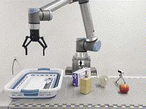  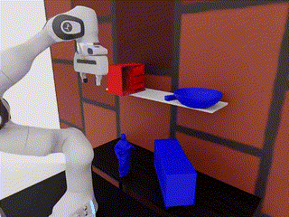

## 💡 Contents

1. [InterndataEngine Integration](#interndataengine-integration)
2. [Release News](#release-news)
3. [Future Features](#future-features-on-the-roadmap)
4. [Installation](#installation)
   - [Docker](#installation-with-docker)
   - [Pip Installation](#installation-with-pip)
   - [uv](#installation-with-uv)
   - [Client-Server](#zmq-server)
   - [MCP (LLM Tool-Calling)](#mcp-llm-tool-calling)
5. [Download Model Checkpoints](#download-checkpoints)
6. [Inference Demos](#inference-demos)
7. [Dataset](#dataset)
8. [Training with Existing Datasets](#training-with-existing-datasets)
9. [Bring Your Own Datasets (BYOD) - Training + Data Generation for new grippers and objects](#training--data-generation-for-new-objects-and-grippers)
10. [GraspGen Format and Conventions](#graspgen-conventions)
11. [LLM Tool-calling with GraspGen](#llm-tool-calling-with-graspgen)
12. [Omniverse and USD Support](#omniverse-and-usd-support)
13. [FAQ](#faq)
14. [License](#license)
15. [Citation](#citation)
16. [Contact](#contact)

## InterndataEngine Integration

Run the commands below from the InterndataEngine repository root. The tested
environment is `graspgen-interndata`; complete environment and robot-profile
details are in [INTERNDATA.md](INTERNDATA.md).

The project wrapper reads the selected robot YAML, validates its CuRobo links
against the configured URDF, and exports the project-compatible
`float32 N x 17` sparse-grasp format. It also writes an adjacent
`.npy.meta.json` file with the model, URDF, robot profile, and generation
parameters.

### Generate one asset

The InterndataEngine generator defaults to 2,000 diffusion candidates and
exports all 2,000 in confidence order. Pass a smaller explicit `--count` only
when a top-k subset is required. This example writes a separate file and does
not replace the existing `Aligned_grasp_sparse.npy` annotation.

```bash
env CUDA_VISIBLE_DEVICES=0 conda run -n graspgen-interndata python \
  workflows/simbox/tools/graspgen/scripts/generate_interndata_grasps.py \
  --mesh path/to/asset/Aligned_obj.obj \
  --robot-config workflows/simbox/core/configs/robots/panda_omron.yaml \
  --models-dir /data1/yifei/workspace/GraspGenModels \
  --output path/to/asset/Aligned_grasp_sparse_graspgen_panda_all2000.npy \
  --unit m \
  --planner diffusion \
  --seed 0
```

To load this file without changing the Pick API, set the existing pick-skill
option:

```yaml
npy_name: Aligned_grasp_sparse_graspgen_panda_all2000.npy
```

### Regenerate all existing Scene 8 grasp assets

The command below discovers every Scene 8 asset that already has a legacy
`Aligned_grasp_sparse.npy`. It uses four worker processes, assigns one process
slot to each GPU, and creates the same non-destructive output beside every
legacy annotation. Change `-P 4` to the available GPU count.

```bash
export GRASPGEN_MODELS_DIR=/data1/yifei/workspace/GraspGenModels
export SCENE8_ROOT=InternDataAssets/assets/custom/scene_8

rg --files -uu "$SCENE8_ROOT" \
  | rg '/Aligned_grasp_sparse\.npy$' \
  | sort \
  | xargs -P 4 --process-slot-var=GRASPGEN_GPU -I '{}' bash -c '
      set -euo pipefail
      legacy="$1"
      asset_dir="${legacy%/*}"
      env CUDA_VISIBLE_DEVICES="$GRASPGEN_GPU" \
        conda run -n graspgen-interndata python \
        workflows/simbox/tools/graspgen/scripts/generate_interndata_grasps.py \
        --mesh "$asset_dir/Aligned_obj.obj" \
        --robot-config workflows/simbox/core/configs/robots/panda_omron.yaml \
        --models-dir "$GRASPGEN_MODELS_DIR" \
        --output "$asset_dir/Aligned_grasp_sparse_graspgen_panda_all2000.npy" \
        --unit m --planner diffusion --seed 0
    ' _ '{}'
```

Each successful asset must have both files:

```text
Aligned_grasp_sparse_graspgen_panda_all2000.npy
Aligned_grasp_sparse_graspgen_panda_all2000.npy.meta.json
```

The current Scene 8 meshes use meters. Revalidate `--unit` before applying this
command to another asset collection. A valid shape, rotation matrix, and model
confidence only verify the annotation contract; they do not prove collision-free
execution or successful grasping in Isaac Sim or on a physical robot.

Panda, Piper, R5A, Genie, FR3, and Tracer2 project profiles can use this wrapper
without a task-side gripper argument. Unless a matching official checkpoint is
available, automatic robot/URDF adaptation does not make the Franka checkpoint
a robot-specific trained model.

## Release News

- \[06/21/2026\] Added Mixture-of-Experts. Top-Down and Side-grasps now supported.

- \[06/21/2026\] Add VLA/policy data generation example.

- \[03/03/2026\] Added MCP for calling GraspGen as a tool by an LLM. See [mcp/](mcp/).

- \[03/03/2026\] ZMQ-based server added to run GraspGen without any installation in your application. See [client-server/](client-server/)

- \[02/18/2026\] Paper accepted to ICRA'26, see you in Vienna 🚀🇦🇹

- \[10/28/2025\] Add feature of filtering out colliding grasps based on scene point cloud.

- \[09/30/2025\] Isaac-Lab based grasp data generation released as [GraspDataGen](https://github.com/NVlabs/GraspDataGen) package (Note: [Data gen for suction grippers is in this repo](grasp_gen/dataset/suction.py))

- \[07/16/2025\] Initial code release! Version `1.0.0`

- \[03/18/2025\] Dataset release on [Hugging Face](https://huggingface.co/datasets/nvidia/PhysicalAI-Robotics-GraspGen)!

- \[03/18/2025\] Blog post on Model deployment at [Intrinsic.ai](https://www.intrinsic.ai/blog/posts/intrinsic-and-nvidia-deepen-platform-integrations-for-intelligent-robotics)


## Future Features on the roadmap

- ~~Data generation repo for antipodal grippers based on [Isaac Lab](https://isaac-sim.github.io/IsaacLab/main/index.html) (Note: [Data gen for suction grippers already released](grasp_gen/dataset/suction.py))~~
- ~~Collision-filtering example~~
- ~~Finetuning with real data**[Not planned anymore, lack of time]**~~
- ~~PTV3 backbone does not (yet) run on Cuda 12.8/Blackwell GPUs due to a [dependency issue](https://github.com/Pointcept/PointTransformerV3/issues/159). If using Cuda 12.8, please use PointNet++ backbone for now until its resolved. [A working PTv3 example has been added to GraspGenX](https://github.com/NVlabs/GraspGenX/blob/main/graspgenx/models/ptv3/ptv3_vanilla.py)~~ 

## Installation
Choose your preferred installation method. For training, we recommend **docker**. For inference, **uv** is the fastest and easiest option. If you would like to run GraspGen as a standalone server (e.g. for tool-calling from an LLM agent or a remote robot client), see [client-server/README.md](client-server/README.md). We also added a MCP to call GraspGen with an LLM.

**✅ All methods fully tested and working!**

| Method | Use Case | Complexity | Speed | 
|--------|----------|------------|-------|
| **Docker** | Training + Inference | ⭐⭐⭐ Recommended for training | Slow |
| **Pip** and **uv** | Inference | ⭐⭐ Recommended for inference | Fast |
| **ZMQ Server** | Remote inference (no install needed on client) | ⭐ See [client-server/](client-server/) | Fast |
| **MCP** | LLM tool-calling | ⭐ See [mcp/](mcp/) | Fast |

### Installation with Docker
```bash
git clone https://github.com/NVlabs/GraspGen.git && cd GraspGen
bash docker/build.sh # This will take a while
```

### Installation with pip inside Conda/Python virtualenv
**[Optional]** If you do not already have a conda env, first create one:
```bash
conda create -n GraspGen python=3.10 -y && conda activate GraspGen
```
**[Optional]** If you do not already have pytorch installed:
```bash
pip install torch==2.1.0 torchvision==0.16.0 torch-cluster torch-scatter -f https://data.pyg.org/whl/torch-2.1.0+cu121.html
```
Install with pip:
```bash
# Clone repo and install
git clone https://github.com/NVlabs/GraspGen.git && cd GraspGen && pip install -e .

# Install PointNet dependency (automated script handles CUDA environment)
./install_pointnet.sh
```

**NOTE:** The `install_pointnet.sh` script automatically handles CUDA environment variables. Ensure you have CUDA runtime headers and a C++ compiler installed. You can also manually run it as follows:
```bash
export CC=/usr/bin/g++ && export CXX=/usr/bin/g++ && export CUDAHOSTCXX=/usr/bin/g++ && export TORCH_CUDA_ARCH_LIST="8.6" && cd pointnet2_ops && pip install --no-build-isolation .
```


### Installation with uv 🚀
uv installation is recommended if you would just like to run inference.

**[Optional]** Install uv if not already installed:
```bash
curl -LsSf https://astral.sh/uv/install.sh | sh
source ~/.bashrc  # or restart terminal
```

**Cloning repo and installing:**
```bash
# Clone repo and setup everything
git clone https://github.com/NVlabs/GraspGen.git && cd GraspGen

# Create Python environment and install all dependencies
uv python install 3.10 && uv venv --python 3.10 .venv && source .venv/bin/activate
uv pip install -e .

# Install PointNet dependency (automated script handles CUDA environment)
./install_uv_pointnet.sh
```

To check if installation has succeeded, run the following test:
```bash
python tests/test_inference_installation.py
```

### ZMQ Server

To run GraspGen as a standalone inference server that any client can query without installing the full stack, see [client-server/README.md](client-server/README.md).

### MCP (LLM Tool-Calling)

To enable LLMs to call GraspGen as a tool, see [mcp/README.md](mcp/README.md).

## Download Checkpoints

The checkpoints can be downloaded from [HuggingFace](https://huggingface.co/adithyamurali/GraspGenModels):
```
git clone https://huggingface.co/adithyamurali/GraspGenModels
```

## Inference Demos

We have added scripts for visualizing grasp predictions on real world point clouds using the models. The sample dataset is in the models repository in the `sample_data` folder. Please see the script args for use. For plotting just the topk grasps (used on the real robot, `k=100` by default) pass in the `--return_topk` flag. To visualize for different grippers, modify the `--gripper_config` argument.

### Prerequisites

1. **Dataset:** Please [download checkpoints](#download-checkpoints) first - this will be the `<path_to_models_repo>` below.
2. **Docker:** The first argument is the path to where you have locally cloned the GraspGen repository (always required). Use `--models` flag for the models directory. These will be mounted at `/code` and `/models` paths inside the container respectively. 
```bash
# For inference only
bash docker/run.sh <path_to_graspgen_code> --models <path_to_models_repo>
```

### Predicting grasps for segmented object point clouds

```bash
cd /code/ && python scripts/demo_object_pc.py --sample_data_dir /models/sample_data/real_object_pc --gripper_config /models/checkpoints/graspgen_robotiq_2f_140.yml
```
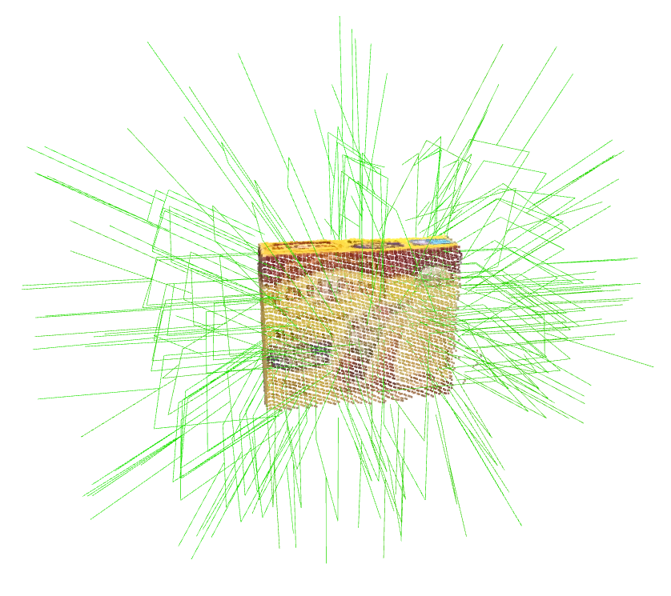 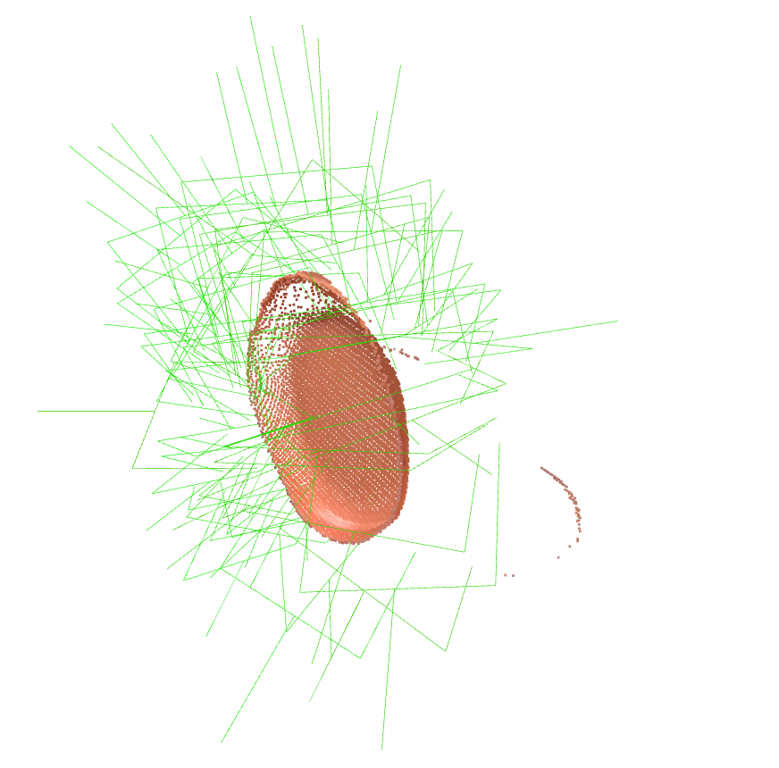 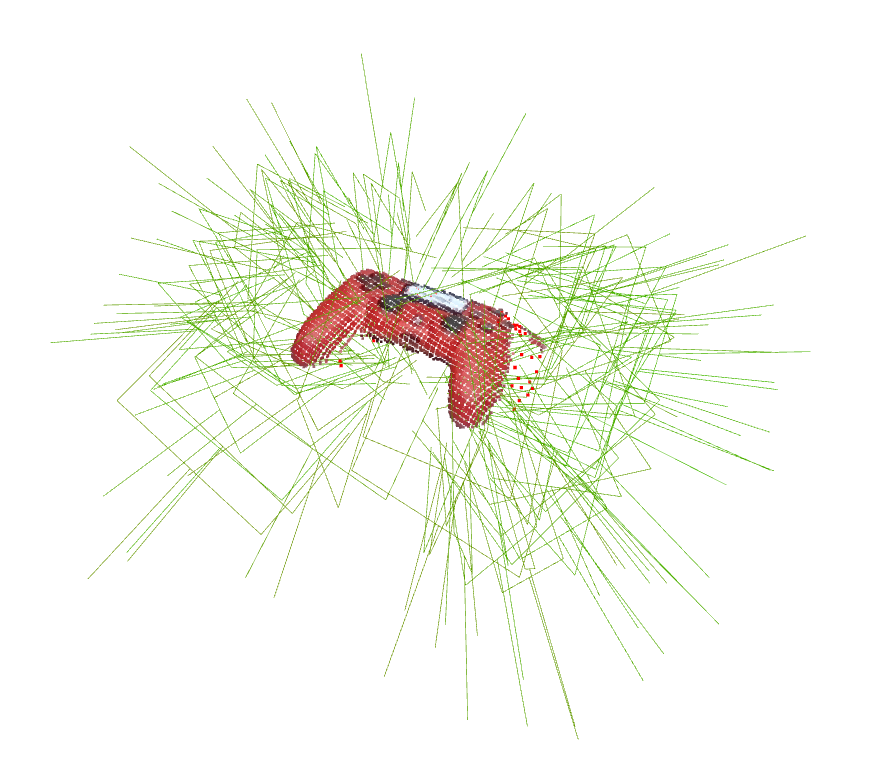 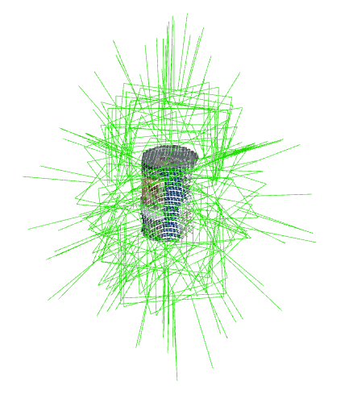 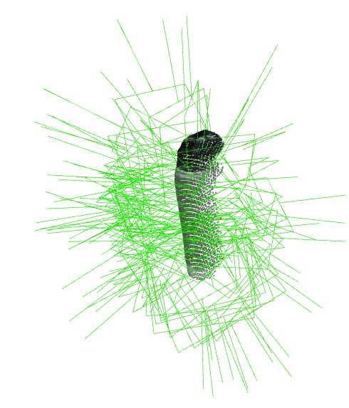 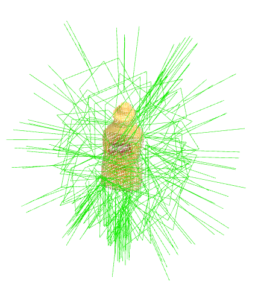

### Predicting grasps for object meshes
Supports `.obj`, `.stl`, and `.ply` formats.
```bash
cd /code/ && python scripts/demo_object_mesh.py --mesh_file /models/sample_data/meshes/box.obj --mesh_scale 1.0 --gripper_config /models/checkpoints/graspgen_robotiq_2f_140.yml
```

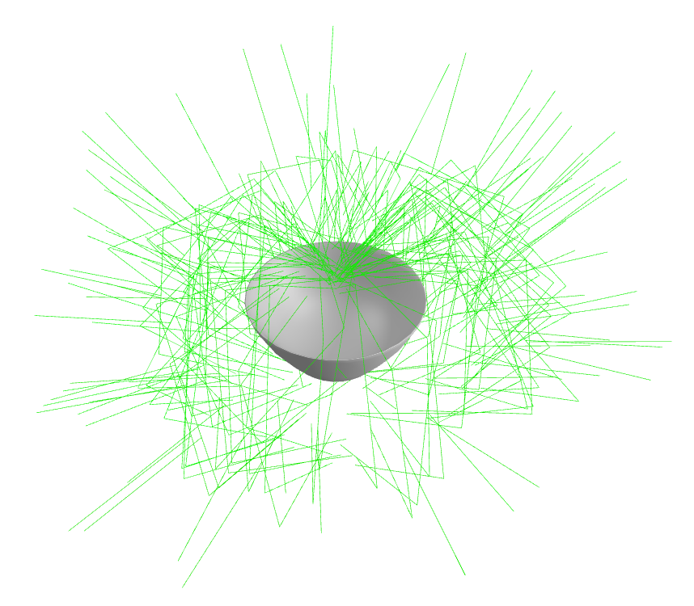 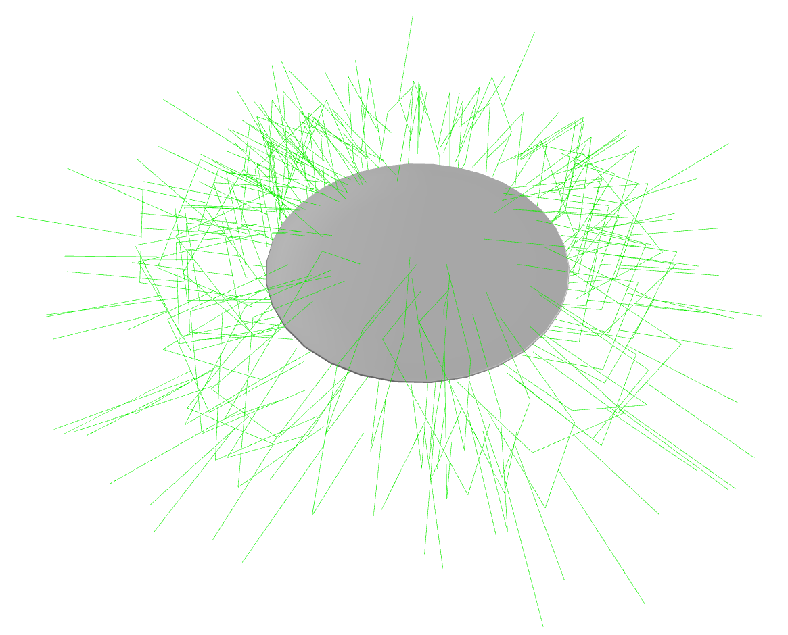 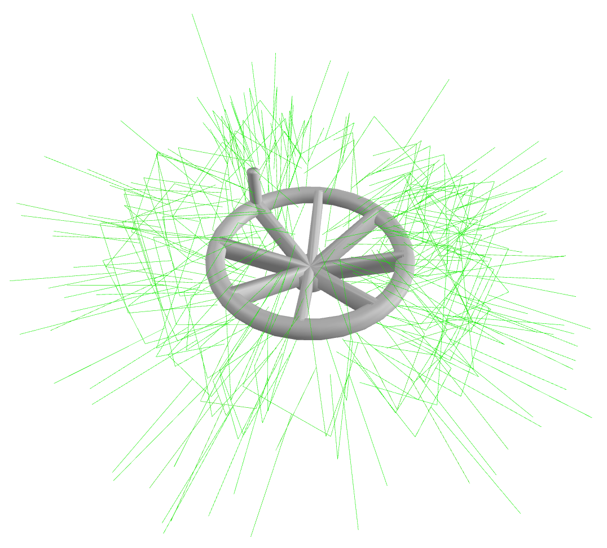

### **[Advanced]** Predicting grasps for objects from scene point clouds
```bash
cd /code/ && python scripts/demo_scene_pc.py --sample_data_dir /models/sample_data/real_scene_pc --gripper_config /models/checkpoints/graspgen_robotiq_2f_140.yml
```
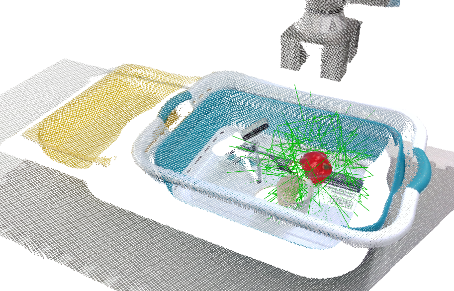 

### **[Advanced]** Predicting grasps for objects from scene point clouds, with collision checking
If you would like to filter the inferred grasps based on collisions, use the `--filter_collisions` flag. This uses a simple point cloud based collision checker. On the real robot, we suggest using [NVBlox](https://github.com/NVlabs/nvblox_torch). The grasp is in collision if it is <span style="color:red">**red**</span>, and <span style="color:green">**green**</span> if collision free. See `scripts/demo_collision_free_grasps.py` if you want to pass in your own scene using the depth and segmentation image as commandline arguments.
```bash
cd /code/ && python scripts/demo_scene_pc.py --filter_collisions --sample_data_dir /models/sample_data/real_scene_pc --gripper_config /models/checkpoints/graspgen_franka_panda.yml
```
 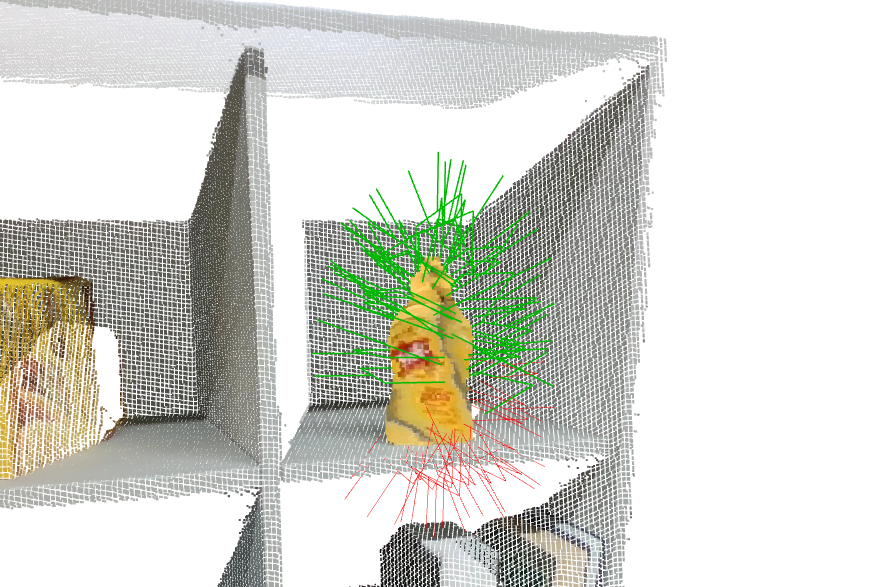  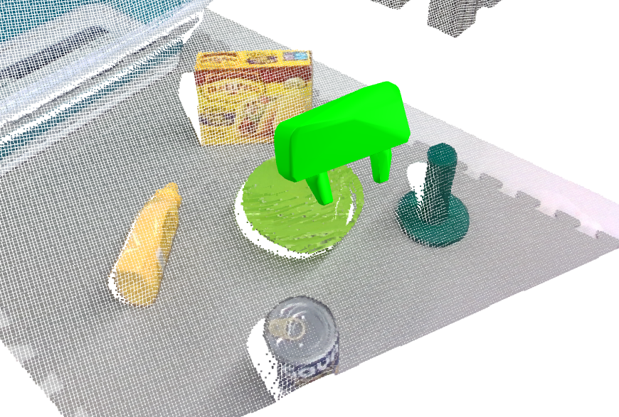 

<!-- An example of a grasp that is colliding (left) vs collision-free (right) is show below.
<!--   -->

<small>Note: At the time of release of this repo, the suction checkpoint was not trained with on-generator training, hence may not output the best grasp scores.</small>

## Dataset

There are two datasets to download:
1. **Grasp Dataset**: This can be cloned from [HuggingFace](https://huggingface.co/datasets/nvidia/PhysicalAI-Robotics-GraspGen). Where you clone this would be `<path_to_grasp_dataset>`.
```
git clone https://huggingface.co/datasets/nvidia/PhysicalAI-Robotics-GraspGen
```
2. **Object Dataset**: We have included a [script](scripts/download_objects.py) for downloading the object dataset below. We recommend running this inside the docker container (the `simplify` arg would not work otherwise). You'll have to specify the directory to save the dataset `<path_to_object_dataset>`. We have only tested the training with simplified meshes (hence the `--simplify` arg), which was crucial to increasing rendering and simulation speed. This script may take a few hours to complete downloading and will take up a lot of CPU. If you are running inside a docker container, you'll need to mount a location to save this data.

First start the docker:
```bash
# For Dataset download only
mkdir -p <object_dataset>
bash docker/run.sh <path_to_graspgen_code> --grasp_dataset <path_to_grasp_dataset> --object_dataset <path_to_object_dataset>
```

```bash
cd /code && python scripts/download_objects.py --uuid_list /grasp_dataset/splits/franka_panda/ --output_dir /object_dataset --simplify
```

In total, we release over 57 million grasps, computed for a subset of 8515 objects from the [Objaverse XL](https://objaverse.allenai.org/) (LVIS) dataset. These grasps are specific to three grippers: Franka Panda, the Robotiq-2f-140 industrial gripper, and a single-contact suction gripper (30mm radius). 

 

## Training with Existing Datasets

This section covers training on existing pre-generated datasets for the three grippers. For a more detailed tutorial on generating your own dataset as well as training a model, please see [TUTORIAL.md](tutorials/TUTORIAL.md)

### Prerequisites

1. **Dataset:** Please see the [Dataset](#dataset) section and download the grasp and object datasets first.
2. **Path setup**: You will need to find out the following paths for the next step
- `<path_to_graspgen_code>`: Local path to where the graspgen repo was cloned
- `<path_to_grasp_dataset>`: Local path to where grasp dataset was cloned.
- `<path_to_object_dataset>`: Local path to where object dataset was downloaded.
- `<path_to_results>`: Local path to where training logs and cache would be saved.
3. **Docker:** Start the docker container with the correct paths:
```bash
# For training only.
mkdir -p <path_to_results>
bash docker/run.sh <path_to_graspgen_code> --grasp_dataset <path_to_grasp_dataset> --object_dataset <path_to_object_dataset> --results <path_to_results>
```

See the training scripts in `runs/`. For each gripper, there are models to train separately - the generator (diffusion model) as well as the discriminator.

```bash
# Example usage for training the generator
cd /code && bash runs/train_graspgen_robotiq_2f_140_gen.sh

# Example usage for training the discriminator
cd /code && bash runs/train_graspgen_robotiq_2f_140_dis.sh
```

Things to note regarding training:
- The experiments in this paper were run with 8 X A100 machines. We have tested this on V100, A100, H100 and L40s
- **Dataset Caching:** Before starting the actual training, the script builds a cache of the dataset and saves to a hdf5 `.h5` file in the specified cache directory. Both caching and training is handled in the same `train_graspgen.py` script with same arguments. If a cache does not exist or is incomplete, the script will build the cache and will automatically continue with training once caching is complete. If the cache already exists, the script will immediately start the training.
- **On-Generator training:** On-Generator training is not released for the discriminator training (yet). It will be released when the data generation repo is released. This is needed for the best performance and scoring of the predicted grasps (see paper).

### Important Training Arguments
- `NGPU`: Set to the number of GPUs you have for training
- `LOG_DIR`: Specifies where the tensorboard logs, checkpoints and console logs are saved to
- `NWORKERS`: A rule of thumb is to set to a non-zero number, roughly `Number of CPU of Cores` / `Number of GPUs`
- `NUM_REDUNDANT_DATAPOINTS`: parameter controls the redundancy (of camera viewpoints) in cache building. The higher the number, the better the domain randomization and sim2real transfer. Default is 7. There will be a `OOM` error if it is too high.
- `debug` mode: To run the job on a single GPU job and 1 worker, you can set the arg `train.debug=True`

### Monitoring Training and Estimates:
- **Generator**: Grasp reconstruction error `reconstruction/error_trans_l2` on the validation set should converge to a few `cm`; this run will take at least 3K epochs to converge; on a 8 X A100 node, it takes about 40 hrs for 3K epochs
- **Discriminator**: Validation AP score should be > 0.8 and `bce_topk` loss should go down; this run will take at least 3K epochs to converge; on a 8 X A100 node, it takes about 90 hrs for 3K epochs

## Training & Data Generation (for new objects and grippers)

Please see [TUTORIAL.md](tutorials/TUTORIAL.md) for a detailed walkthrough of training a model from scratch, including grasp data generation. Currently, we include an example for suction grippers. See the [GraspDataGen](https://github.com/NVlabs/GraspDataGen) package for Isaac Lab based grasp data generation for pinch grippers.

## GraspGen Conventions

Please see the following files for documentation on the formats we adopted:
- Gripper configuration: [GRIPPER_DESCRIPTION.md](docs/GRIPPER_DESCRIPTION.md)
- Grasp Dataset format: [GRASP_DATASET_FORMAT.md](docs/GRASP_DATASET_FORMAT.md)

See the [GraspDataGen](https://github.com/NVlabs/GraspDataGen) package for Isaac Lab based grasp data generation in the above format.

## LLM Tool-calling with GraspGen

GraspGen can be deployed as a standalone ZMQ server, making it callable as a tool from LLM agents, remote robot controllers, or any application — without importing model code or needing a local GPU. See [client-server/README.md](client-server/README.md) for full documentation, protocol reference, and examples.

```bash
# Start the server (Docker):
bash docker/run_server.sh $(pwd) --models /path/to/GraspGenModels

# Call it from a client (Python — no CUDA required):
python client-server/graspgen_client.py --mesh_file /path/to/mesh.obj --host localhost --port 5556
```

## Omniverse and USD Support

GraspGen supports **USD** meshes (`.usd`, `.usda`, `.usdc`, `.usdz`) for inference and can write predicted grasps back into USD for **Omniverse** / Isaac Sim. A single USD can contain the object mesh, **`/world/grasps`** (pose Xforms only), and **`/world/grasps_visualization`** (same poses + gripper wireframes). Meshes are converted with [scene_synthesizer](https://github.com/NVlabs/scene_synthesizer). Commands for running on an example object [assets/objects/box.obj](assets/objects/box.obj):

```bash
# 1) OBJ → USD 
python scripts/convert_obj_to_usd.py --input assets/objects/box.obj --output /tmp/box.usd

# 2) Run inference, save grasps to YAML
python scripts/demo_object_mesh.py --mesh_file /tmp/box.usd --mesh_scale 1.0 \
  --gripper_config GRIPPER_CONFIG --output_file /tmp/box_grasps.yml --no-visualization --num_grasps 50

# 3) Write grasps + grasps_visualization into the USD
python scripts/save_grasps_to_usd.py --usd_file assets/objects/box.usd --grasps_yaml /tmp/box_grasps.yml \
  --gripper_name robotiq_2f_140 --output assets/objects/box_with_grasps.usd
```

Optional: **`--wireframe_width W`** (default `0.001`), **`--no_visualization`** to skip wireframes. See [Inference Demos](#inference-demos) for other formats (`.obj`,`.pcd`.etc).

### Running grasps in Isaac Sim (10 envs, play-to-grasp)

You can generate a **sim USD** with up to 10 environments: each env has the object and one gripper at a predicted grasp pose. When you open this USD in **Omniverse / Isaac Sim** and press **Play**, the grippers close and grasp the object. A Robotiq 2F-85 gripper USD is included under `assets/bots/robotiq_2f_85.usd` (copied from [GraspDataGen](https://github.com/NVlabs/GraspDataGen)).

**1. Run inference (max 10 grasps) and save YAML**

```bash
python scripts/demo_object_mesh.py --mesh_file /tmp/box.usd --mesh_scale 1.0 \
  --gripper_config GRIPPER_CONFIG --output_file /tmp/box_grasps.yml --no-visualization --num_grasps 10
```

**2. Build the sim USD** (`box_with_grasps_sim.usd`)

```bash
python scripts/create_grasp_sim_usd.py --object_usd assets/objects/box.usd \
  --grasps_yaml /tmp/box_grasps.yml --output assets/objects/box_with_grasps_sim.usd --num_envs 10
```

**3. Open in Isaac Sim and run the grasp script**

- In **Isaac Sim**: **File → Open** and open `assets/objects/box_with_grasps_sim.usd`.
- Press **Play** to start the simulation.
- In **Window → Script Editor**, open and run `scripts/run_grasp_sim_omniverse.py`.  
  This script registers a callback so that after a short delay the grippers move to the closed position and grasp the object.

Options for `create_grasp_sim_usd.py`: **`--gripper_usd`** (default `assets/bots/robotiq_2f_85.usd`), **`--num_envs`** (default `10`), **`--env_spacing`** (default `0.6` m).

## FAQ

### How do I train for a new gripper?

Please let us know what gripper you are interested in this [short survey](https://docs.google.com/forms/d/e/1FAIpQLSdTCstEtaeZz5iSyjAhYFuJqSpMF671ftPylkS3ZJFhRIg3dg/viewform?usp=dialog).

For optimal performance on a new gripper, we recommend re-training the model with our specified training recipie. You will need following to achieve that:

* Gripper URDF. See [assets/](assets/) for examples.
* Gripper description in the GraspGen format. See [GRIPPER_DESCRIPTION.md](docs/GRIPPER_DESCRIPTION.md).
* Object-Grasp dataset for this gripper consisting of successful and unsuccessful grasps. See [GRASP_DATASET_FORMAT.md](docs/GRASP_DATASET_FORMAT.md)

Please see [TUTORIAL.md](tutorials/TUTORIAL.md) for a detailed walkthrough of training a model from scratch, including grasp data generation. See [GraspDataGen](https://github.com/NVlabs/GraspDataGen) for data generation.

### My gripper is very similar to one of the existing grippers. Could I re-target model for my gripper?

In most cases, we recommend re-training a new model specific to your gripper as the physics would have changed.

If your gripper is antipodal and has a similar stroke length (i.e. width) to one of the existing grippers (Franka/Robotiq), feel free to re-target the model. You may have to apply a offset along the z direction `import trimesh.transformations as tra; new_grasp = grasp @ tra.translation_matrix([0,0,-Z_OFFSET])` to align the base link frames of both grippers.

If you are using a single-cup suction gripper, you could retarget our suction model trained for a 30mm suction seal.  You could rescale the object point cloud/mesh input before inference `import trimesh.transformations as tra; mat = tra.scale_matrix(r/0.030)` where `r` is the radius of the suction cup for your gripper.


### How do I finetune on new object dataset?

The graspgen model is meant to generalize zero-shot to unknown objects. If you would like to further finetune the model on a new object/grasp dataset combination or train on a larger dataset, you will need to 1) pass in the pretrained checkpoint in the `train.checkpoint` argument in the train script and 2) change the paths to the new grasp/object dataset. Please check the [GRASP_DATASET_FORMAT.md](docs/GRASP_DATASET_FORMAT.md) convention.

### Why is my train script hanging/getting killed without any errors?
Make sure your docker container has sufficient CPU, swap and GPU memory. Please post a github issue otherwise.

### How do I run this on the robot?

You will need instance segmentation (e.g. [SAM2](https://ai.meta.com/sam2/)) and motion planning (e.g. [cuRobo](https://curobo.org/)) to run this model. More details can be found in the experiments section of the paper.

### You did not include the gripper I have/want with your dataset!
Sorry we missed your gripper! Please consider completing this quick [survey](https://docs.google.com/forms/d/e/1FAIpQLSdTCstEtaeZz5iSyjAhYFuJqSpMF671ftPylkS3ZJFhRIg3dg/viewform?usp=dialog) to describe your gripper. You can optionally leave a your URDF.

### How do I report a bug or ask more detailed questions?
Please post a github issue and we will follow up! Or feel free to email us.

### Contributions?
Contributions are welcome! Please submit a PR.

## License
License Copyright © 2025, NVIDIA Corporation & affiliates. All rights reserved.

For business inquiries, please submit the form [NVIDIA Research Licensing](https://www.nvidia.com/en-us/research/inquiries/).

## Citation

If you found this work to be useful, please considering citing:

```
@inproceedings{murali2025graspgen,
  title     = {GraspGen: A Diffusion-based Framework for 6-DOF Grasping with On-Generator Training},
  author    = {Murali, Adithyavairavan and Sundaralingam, Balakumar and Chao, Yu-Wei and Yamada, Jun and Yuan, Wentao and Carlson, Mark and Ramos, Fabio and Birchfield, Stan and Fox, Dieter and Eppner, Clemens},
  booktitle = {Proceedings of the IEEE International Conference on Robotics and Automation (ICRA)},
  year      = {2026},
  publisher = {IEEE},
  url       = {https://arxiv.org/abs/2507.13097}
}
```

## Contact

Please reach out to [Adithya Murali](http://adithyamurali.com) (admurali@nvidia.com) for further enquiries.
